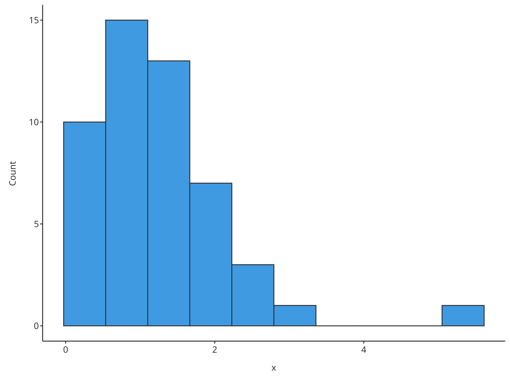
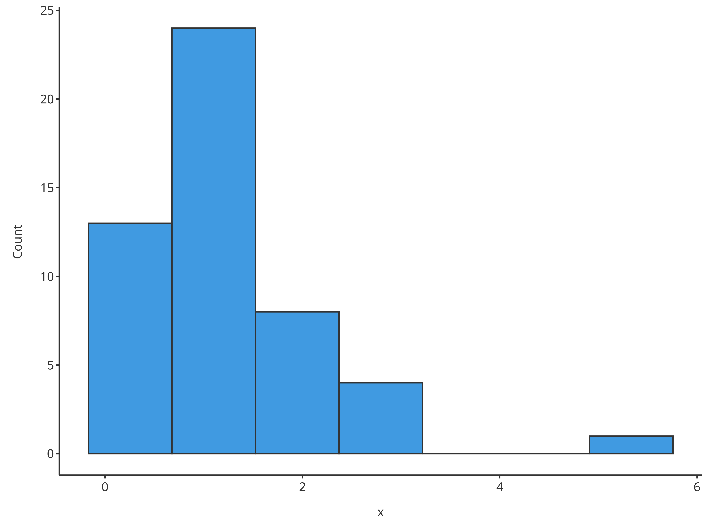
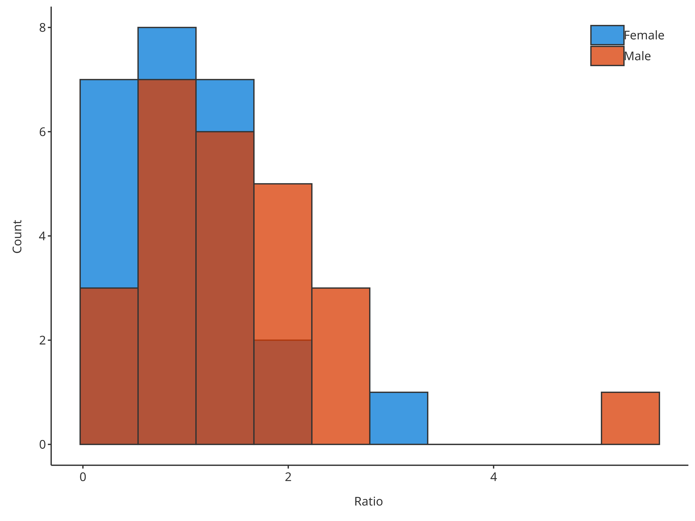
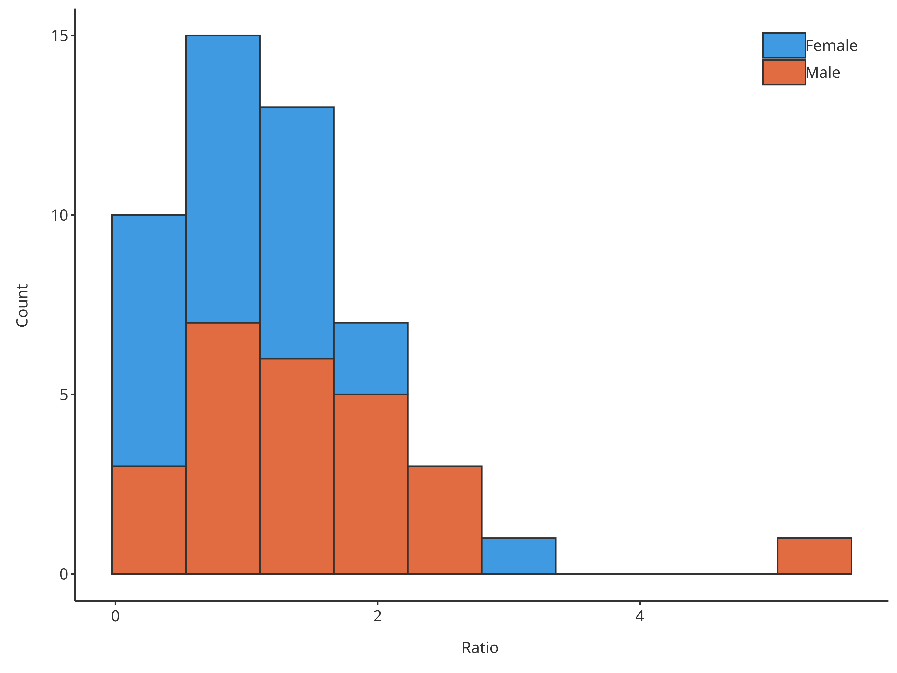
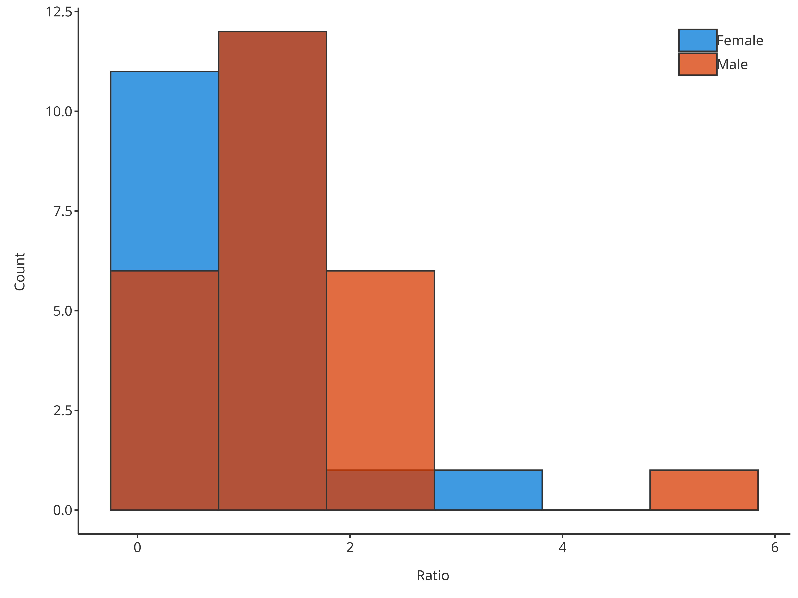
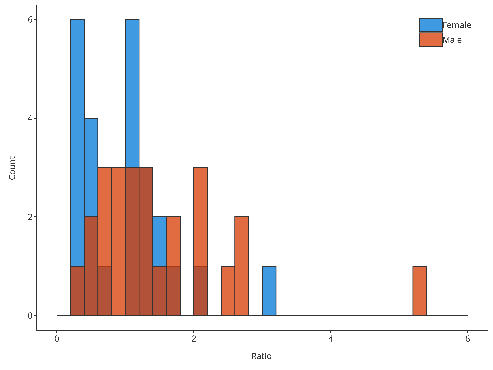
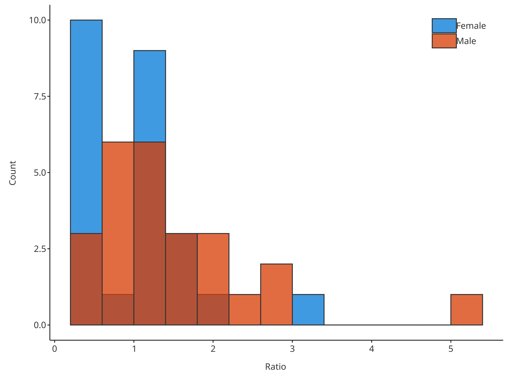
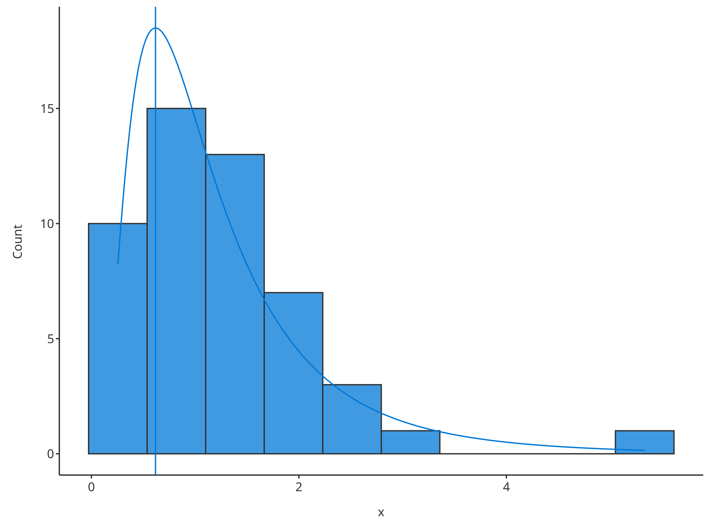
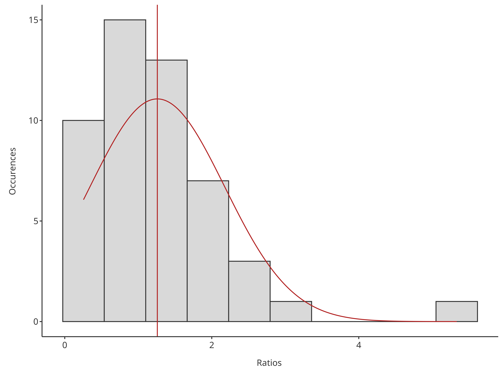

# Histogram Plots

``` r
require(tlf)
#> Loading required package: tlf
```

## 1. Introduction

The following vignette aims at documenting and illustrating workflows
for producing histograms using the function `plotHistogram` from the
`tlf` package.

## 2. Illustration of basic histograms

### 2.1. Data

The data showed in the sequel is available at the following path:
`system.file("extdata", "test-data.csv", package = "tlf")`. In the code
below, the data is loaded and assigned to `histData`.

``` r
# Load example
histData <- read.csv(
  system.file("extdata", "test-data.csv", package = "tlf"),
  stringsAsFactors = FALSE
)

# histData
knitr::kable(utils::head(histData), digits = 2)
```

|  ID | Age |  Obs | Pred | Ratio | AgeBin | Sex  | Country |   SD |
|----:|----:|-----:|-----:|------:|:-------|:-----|:--------|-----:|
|   1 |  48 | 4.00 | 2.90 |  0.72 | Adults | Male | Canada  | 0.69 |
|   2 |  36 | 4.40 | 5.75 |  1.31 | Adults | Male | Canada  | 0.19 |
|   3 |  52 | 2.80 | 2.70 |  0.96 | Adults | Male | Canada  | 0.98 |
|   4 |  47 | 3.75 | 3.05 |  0.81 | Adults | Male | Canada  | 0.59 |
|   5 |   0 | 1.95 | 5.25 |  2.69 | Peds   | Male | Canada  | 0.44 |
|   6 |  48 | 2.45 | 5.30 |  2.16 | Adults | Male | Canada  | 0.07 |

### 2.2. `plotHistogram`

Besides, the usual `tlf` input arguments commonly used by the plot
functions (`data`, `metaData`, `dataMapping`, `plotConfiguration` and
`plotObject`), the function `plotHistogram` also includes the following
optional input arguments:

- `x`: Numeric values used in the histogram instead of `data` and
  `dataMapping`.
- `bins`: Number of bins
- `binwidth`: Width of each bin, overwriting the number of bins.
- `stack`: Logical defining if histogram bars are stacked
- `distribution`: Name of a distribution to fit to the data. Currently,
  only normal and log-normal distributions are available.

### 2.3. Minimal examples

Most of the time, the optional input `x` is convenient to assess the
distribution of the data.

``` r
# Use directly x for quick histogram
plotHistogram(x = histData$Ratio)
#> Warning in ggplot2::geom_histogram(data = mapData, mapping = mapping, position
#> = position, : Ignoring unknown parameters: `size`
```



``` r

# Use directly x and bins for quick histogram with a defined number of bins
plotHistogram(x = histData$Ratio, bins = 7)
#> Warning in ggplot2::geom_histogram(data = mapData, mapping = mapping, position
#> = position, : Ignoring unknown parameters: `size`
```



### 2.4. Examples using `data` and `dataMapping`

Workflows in `tlf` usually includes the definition of `data`, their
`metData` and `dataMapping`.

``` r
# Create HistogramDataMapping object
histoMapping <- HistogramDataMapping$new(
  x = "Ratio",
  fill = "Sex"
)

plotHistogram(
  data = histData,
  dataMapping = histoMapping
)
#> Warning in ggplot2::geom_histogram(data = mapData, mapping = mapping, position
#> = position, : Ignoring unknown parameters: `size`
```



In such cases, the optional arguments previously presented can be
included in `dataMapping`.

``` r
# Create HistogramDataMapping object
histoMapping <- HistogramDataMapping$new(
  x = "Ratio",
  fill = "Sex",
  stack = TRUE
)

plotHistogram(
  data = histData,
  dataMapping = histoMapping
)
#> Warning in ggplot2::geom_histogram(data = mapData, mapping = mapping, position
#> = position, : Ignoring unknown parameters: `size`
```



If defined as `plotHistogram` input arguments, they will overwrite
`dataMapping`.

``` r
# Create HistogramDataMapping object
histoMapping <- HistogramDataMapping$new(
  x = "Ratio",
  fill = "Sex",
  bins = 3
)

# bin defined in both, plotHistogram has priority and overwrites dataMapping internally
plotHistogram(
  data = histData,
  dataMapping = histoMapping,
  bins = 6
)
#> Warning in ggplot2::geom_histogram(data = mapData, mapping = mapping, position
#> = position, : Ignoring unknown parameters: `size`
```


### 2.5. Focus on binning

There are 3 ways of defining how the data is binned. The priority
between each method was defined according to their specificity. Method
1, the simplest and used as default, defines the number of bins. It can
be overwritten by method 3, which defines the width of each bin. Method
2 is the more specific and defines the bin edges, consequently it cannot
be overwritten by method 3.

\*1. Define the number of bins with the input argument `bins` (using a
single value)

``` r
# Create HistogramDataMapping object
histoMapping <- HistogramDataMapping$new(
  x = "Ratio",
  fill = "Sex"
)

# Define the number of bins in final plot
plotHistogram(
  data = histData,
  dataMapping = histoMapping,
  bins = 6
)
#> Warning in ggplot2::geom_histogram(data = mapData, mapping = mapping, position
#> = position, : Ignoring unknown parameters: `size`
```



\*2. Define the edges of the bins with the input argument `bins` (using
an array of values)

``` r
# Create HistogramDataMapping object
histoMapping <- HistogramDataMapping$new(
  x = "Ratio",
  fill = "Sex"
)

# Define the edges of bins in final plot
plotHistogram(
  data = histData,
  dataMapping = histoMapping,
  bins = seq(0, 6, 0.2)
)
#> Warning in ggplot2::geom_histogram(data = mapData, mapping = mapping, position
#> = position, : Ignoring unknown parameters: `size`
```



\*3. Define the width of bins with the input argument `binwidth` (using
a single value).

``` r
# Create HistogramDataMapping object
histoMapping <- HistogramDataMapping$new(
  x = "Ratio",
  fill = "Sex"
)

# Define the width of bins in final plot
plotHistogram(
  data = histData,
  dataMapping = histoMapping,
  binwidth = 0.4
)
#> Warning in ggplot2::geom_histogram(data = mapData, mapping = mapping, position
#> = position, : Ignoring unknown parameters: `size`
```



### 2.6. Focus on distribution fit

The optional input `distribution` aims at providing the possibility of
fitting the data distribution. Currently, two distributions can be
fitted by the function `plotHistogram`:

- Fit a normal distribution and draw the distribution mean as vertical
  line using `"normal"`
- Fit a log-normal distribution and draw the distribution mode as
  vertical line using `"logNormal"`

``` r
# Plot normal distribution
plotHistogram(
  x = histData$Ratio,
  distribution = "normal"
)
#> Warning in ggplot2::geom_histogram(data = mapData, mapping = mapping, position
#> = position, : Ignoring unknown parameters: `size`
```


``` r

# Plot normal distribution
plotHistogram(
  x = histData$Ratio,
  distribution = "logNormal"
)
#> Warning in ggplot2::geom_histogram(data = mapData, mapping = mapping, position
#> = position, : Ignoring unknown parameters: `size`
```



To compare multiple distributions, they can be defined through the
`dataMapping`:

``` r
# Create HistogramDataMapping object split by gender
histoMapping <- HistogramDataMapping$new(
  x = "Ratio",
  fill = "Sex"
)

# Plot normal distribution for each gender
plotHistogram(
  data = histData,
  dataMapping = histoMapping,
  distribution = "normal"
)
#> Warning in ggplot2::geom_histogram(data = mapData, mapping = mapping, position
#> = position, : Ignoring unknown parameters: `size`
```


With option `stack`, it is also possible to get the distribution of the
sum only while splitting the content of the bars.

``` r
# Create HistogramDataMapping object split by gender
histoMapping <- HistogramDataMapping$new(
  x = "Ratio",
  fill = "Sex"
)

# Plot normal distribution of sum but bars are split by gender
plotHistogram(
  data = histData,
  dataMapping = histoMapping,
  distribution = "normal",
  stack = TRUE
)
#> Warning in ggplot2::geom_histogram(data = mapData, mapping = mapping, position
#> = position, : Ignoring unknown parameters: `size`
```


The `HistogramPlotConfiguration` objects can be used to tune the final
plot aesthetics.

``` r
histoConfiguration <- HistogramPlotConfiguration$new(
  xlabel = "Ratios",
  ylabel = "Occurences"
)
histoConfiguration$ribbons$fill <- "grey80"
histoConfiguration$lines$color <- "firebrick"

# Plot normal distribution of sum but bars are split by gender
plotHistogram(
  x = histData$Ratio,
  plotConfiguration = histoConfiguration,
  distribution = "normal"
)
#> Warning in ggplot2::geom_histogram(data = mapData, mapping = mapping, position
#> = position, : Ignoring unknown parameters: `size`
```


