# Introduction to PlotConfiguration objects

``` r
require(tlf)
#> Loading required package: tlf
```

This vignette tackles about *PlotConfiguration* objects and their
implementation within the `tlf`-library.

## 1. Introduction

*PlotConfiguration* objects are R6 class objects that define plot
properties.

To create such an object, the method *new()* is required. Multiple
arguments can be passed on the method in order to directly define the
properties. The properties default values can be handled and managed
using the concept of themes.

As the example below illustrates, the following plot properties are
defined by the **PlotConfiguration** class. Each of these properties is
managed by a different R6 class object detailed in the next sections:

- *labels*
- *background*
- *xAxis*/*yAxis*
- *legend*
- *export*
- *points*/*lines*/*ribbons*/*errorbars*

``` r
# Creates a PlotConfiguration with default properties
myConfiguration <- PlotConfiguration$new()

myConfiguration
#> <PlotConfiguration>
#>   Public:
#>     background: active binding
#>     clone: function (deep = FALSE) 
#>     defaultExpand: FALSE
#>     defaultSymmetricAxes: FALSE
#>     defaultXScale: lin
#>     defaultYScale: lin
#>     errorbars: active binding
#>     export: ExportConfiguration, R6
#>     initialize: function (title = NULL, subtitle = NULL, xlabel = NULL, ylabel = NULL, 
#>     labels: active binding
#>     legend: active binding
#>     lines: active binding
#>     points: active binding
#>     ribbons: active binding
#>     xAxis: active binding
#>     yAxis: active binding
#>   Private:
#>     .background: BackgroundConfiguration, R6
#>     .errorbars: ThemeAestheticSelections, ThemeAestheticMaps, R6
#>     .labels: LabelConfiguration, R6
#>     .legend: LegendConfiguration, R6
#>     .lines: ThemeAestheticSelections, ThemeAestheticMaps, R6
#>     .points: ThemeAestheticSelections, ThemeAestheticMaps, R6
#>     .ribbons: ThemeAestheticSelections, ThemeAestheticMaps, R6
#>     .xAxis: XAxisConfiguration, AxisConfiguration, R6
#>     .yAxis: YAxisConfiguration, AxisConfiguration, R6
```

``` r
# Creates a PlotConfiguration with title and watermark as user-defined properties
myConfiguration <- PlotConfiguration$new(
  title = "my title",
  watermark = "my watermark"
)

myConfiguration
#> <PlotConfiguration>
#>   Public:
#>     background: active binding
#>     clone: function (deep = FALSE) 
#>     defaultExpand: FALSE
#>     defaultSymmetricAxes: FALSE
#>     defaultXScale: lin
#>     defaultYScale: lin
#>     errorbars: active binding
#>     export: ExportConfiguration, R6
#>     initialize: function (title = NULL, subtitle = NULL, xlabel = NULL, ylabel = NULL, 
#>     labels: active binding
#>     legend: active binding
#>     lines: active binding
#>     points: active binding
#>     ribbons: active binding
#>     xAxis: active binding
#>     yAxis: active binding
#>   Private:
#>     .background: BackgroundConfiguration, R6
#>     .errorbars: ThemeAestheticSelections, ThemeAestheticMaps, R6
#>     .labels: LabelConfiguration, R6
#>     .legend: LegendConfiguration, R6
#>     .lines: ThemeAestheticSelections, ThemeAestheticMaps, R6
#>     .points: ThemeAestheticSelections, ThemeAestheticMaps, R6
#>     .ribbons: ThemeAestheticSelections, ThemeAestheticMaps, R6
#>     .xAxis: XAxisConfiguration, AxisConfiguration, R6
#>     .yAxis: YAxisConfiguration, AxisConfiguration, R6
```

When a `ggplot` object is initialized using the `tlf` method
**`initializePlot`**, a *plotConfiguration* field is added to the plot
object. This field corresponds to a **PlotConfiguration** object and
defining the properties of the initialized plot.

**PlotConfiguration** objects can also be directly passed to the method
*initializePlot* as shown below:

``` r
# Creates an empty plot with default PlotConfiguration properties
emptyPlot <- initializePlot()

emptyPlot$plotConfiguration
#> <PlotConfiguration>
#>   Public:
#>     background: active binding
#>     clone: function (deep = FALSE) 
#>     defaultExpand: FALSE
#>     defaultSymmetricAxes: FALSE
#>     defaultXScale: lin
#>     defaultYScale: lin
#>     errorbars: active binding
#>     export: ExportConfiguration, R6
#>     initialize: function (title = NULL, subtitle = NULL, xlabel = NULL, ylabel = NULL, 
#>     labels: active binding
#>     legend: active binding
#>     lines: active binding
#>     points: active binding
#>     ribbons: active binding
#>     xAxis: active binding
#>     yAxis: active binding
#>   Private:
#>     .background: BackgroundConfiguration, R6
#>     .errorbars: ThemeAestheticSelections, ThemeAestheticMaps, R6
#>     .labels: LabelConfiguration, R6
#>     .legend: LegendConfiguration, R6
#>     .lines: ThemeAestheticSelections, ThemeAestheticMaps, R6
#>     .points: ThemeAestheticSelections, ThemeAestheticMaps, R6
#>     .ribbons: ThemeAestheticSelections, ThemeAestheticMaps, R6
#>     .xAxis: XAxisConfiguration, AxisConfiguration, R6
#>     .yAxis: YAxisConfiguration, AxisConfiguration, R6

emptyPlot
```


Figure: empty plot with default PlotConfiguration properties

``` r
# Creates an empty plot with title and watermark as user-defined properties
myEmptyPlot <- initializePlot(myConfiguration)

myEmptyPlot$plotConfiguration
#> <PlotConfiguration>
#>   Public:
#>     background: active binding
#>     clone: function (deep = FALSE) 
#>     defaultExpand: FALSE
#>     defaultSymmetricAxes: FALSE
#>     defaultXScale: lin
#>     defaultYScale: lin
#>     errorbars: active binding
#>     export: ExportConfiguration, R6
#>     initialize: function (title = NULL, subtitle = NULL, xlabel = NULL, ylabel = NULL, 
#>     labels: active binding
#>     legend: active binding
#>     lines: active binding
#>     points: active binding
#>     ribbons: active binding
#>     xAxis: active binding
#>     yAxis: active binding
#>   Private:
#>     .background: BackgroundConfiguration, R6
#>     .errorbars: ThemeAestheticSelections, ThemeAestheticMaps, R6
#>     .labels: LabelConfiguration, R6
#>     .legend: LegendConfiguration, R6
#>     .lines: ThemeAestheticSelections, ThemeAestheticMaps, R6
#>     .points: ThemeAestheticSelections, ThemeAestheticMaps, R6
#>     .ribbons: ThemeAestheticSelections, ThemeAestheticMaps, R6
#>     .xAxis: XAxisConfiguration, AxisConfiguration, R6
#>     .yAxis: YAxisConfiguration, AxisConfiguration, R6

myEmptyPlot
```

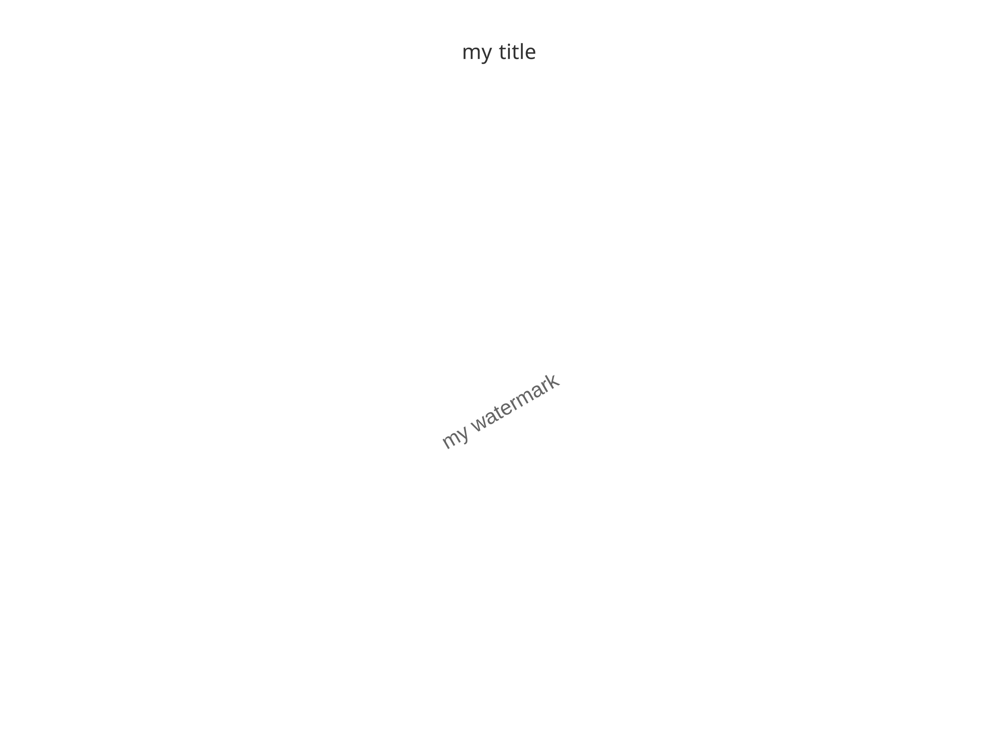

Figure: empty plot with title and watermark as user-defined properties

## 2. Label configuration: *labels*

### 2.1. Label and Label configuration objects

The field *labels* from the *PlotConfiguration* object is a
*LabelConfiguration* object. It defines the label properties of the
following plot captions:

- title
- subtitle
- xlabel
- ylabel
- caption

Each field is a *Label* object that associate a text with font
properties:

``` r
title <- Label$new(
  text = "This is a title text",
  font = Font$new(
    color = "red",
    size = 12
  )
)
```

| text                 | color | size | fontFace | fontFamily | angle | align  |
|:---------------------|:------|-----:|:---------|:-----------|------:|:-------|
| This is a title text | red   |   12 | plain    |            |     0 | center |

When initializing a *LabelConfiguration* or *PlotConfiguration* object,
*Label* and/or *character* objects can be passed on.

*Character* objects will be converted into *Label* objects internally
using the current theme.

``` r
myRedPlotLabel <- LabelConfiguration$new(title = Label$new(
  text = "my title",
  color = "red"
))
```

``` r
Property <- c("text", "font$color", "font$size", "font$angle", "font$align", "font$fontFace", "font$fontFamily")
displayNullValue <- function(value) {
  if (is.null(value)) {
    return("*NULL*")
  }
  return(value)
}
labelProperties <- cbind.data.frame(
  Property = Property,
  sapply(
    c("title", "subtitle", "xlabel", "ylabel", "caption"),
    function(labelName) {
      #
      # Use an expression to get all the properties of the label in one line
      eval(parse(text = paste0(
        "c(", paste0("displayNullValue(myRedPlotLabel[[labelName]]$", Property, ")", collapse = ", "), ")"
      )))
    }
  )
)

knitr::kable(labelProperties)
```

| Property                                                     | title    | subtitle | xlabel | ylabel | caption |
|:-------------------------------------------------------------|:---------|:---------|:-------|:-------|:--------|
| text                                                         | my title | *NULL*   | *NULL* | *NULL* | *NULL*  |
| font$color|red|grey20|grey20|grey20|grey20||font$size        | 12       | 10       | 10     | 10     | 8       |
| font$angle|0|0|0|90|0||font$align                            | center   | center   | center | center | left    |
| font$fontFace|plain|plain|plain|plain|plain||font$fontFamily |          |          |        |        |         |

> \[!CAUTION\] Label elements leverage
> [`ggtext::element_textbox_simple()`](https://wilkelab.org/ggtext/reference/element_textbox.html)
> and use markdown/html formatting. As a consequence, their line breaks
> need to be defined using the html tag `<br>`.

### 2.2. Label configuration in plots

The effect of label configuration in plots is straightforward:

``` r
plotConfigurationLabel1 <- PlotConfiguration$new(
  title = "Title",
  subtitle = "Subtitle",
  xlabel = "x label",
  ylabel = "y label",
  caption = "Caption"
)

pLab1 <- initializePlot(plotConfigurationLabel1)

pLab1
```

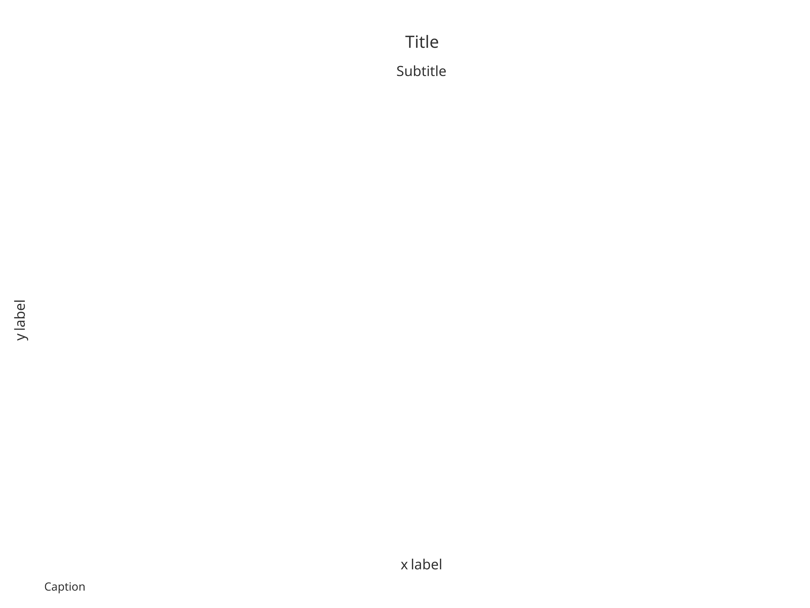

Figure: Empty plot with labels defined as `character` using default
label properties

``` r
plotConfigurationLabel2 <- PlotConfiguration$new(
  title = Label$new(text = "Title", size = 12, color = "deepskyblue4"),
  subtitle = Label$new(text = "Subtitle", size = 11, color = "steelblue"),
  xlabel = Label$new(text = "x label", size = 10, color = "dodgerblue2"),
  ylabel = Label$new(text = "y label", color = "dodgerblue2", angle = 0),
  caption = Label$new(text = "Caption", size = 8, color = "steelblue", align = Alignments$left)
)

pLab2 <- initializePlot(plotConfigurationLabel2)

pLab2
```

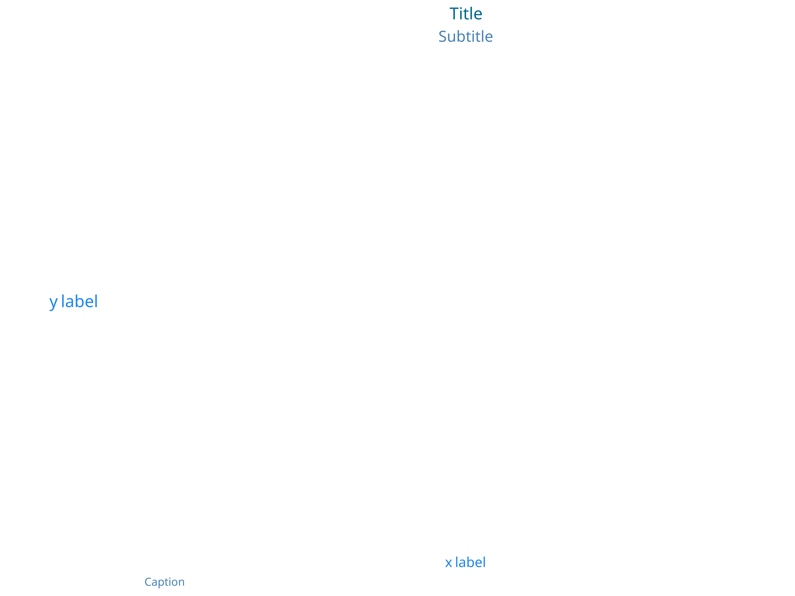

Figure: Empty plot with labels defined as `Label` updating default label
properties

### 2.3. Changing plot labels

After creating a plot, it is possible to change its label configuration
using the `tlf` method *setPlotLabels*. The method requires the plot
object and which label property to update.

Similar to the construction of the Label configuration, *Label* and/or
*character* objects can be passed on.

Using the previous example, *pLab2*,

``` r
setPlotLabels(pLab2, title = "new title")
```

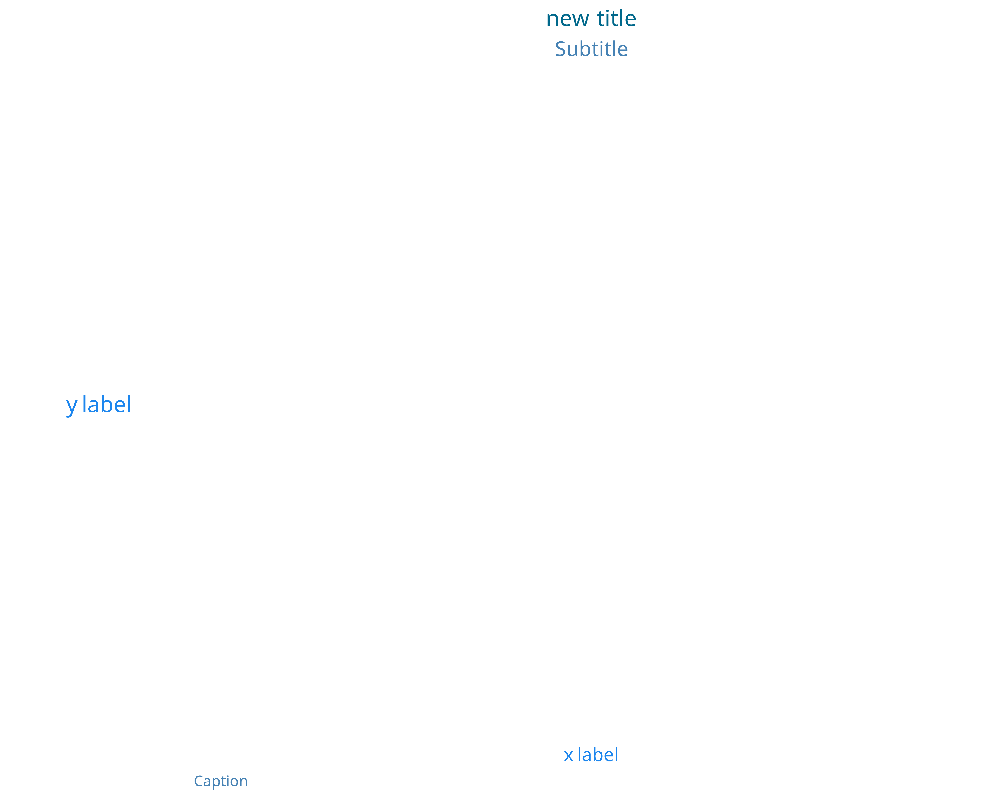

``` r
setPlotLabels(pLab2, title = Label$new(text = "new title", color = "red"))
```

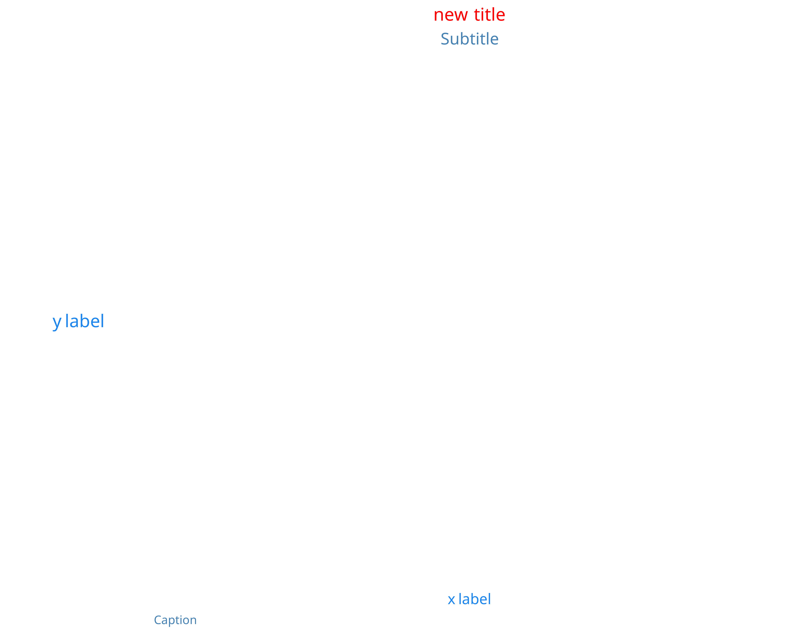

### 2.4. Smart plot configurations

Smart plot labels are available for initializing *PlotConfiguration*
objects. The principle is to provide in advance the *data* that will be
used within the plot. As a consequence, three optional arguments can be
passed on *PlotConfiguration* initialization: *data*, *metaData* and
*dataMapping*.

If no label is specifically defined, the smart configuration will fetch
`x` and `y` labels within *data* and *metaData* names based on the
*dataMapping*. *dataMapping* also uses smart functions that will check
the input data frame - if not specifically initialized - and will use
variables named “x” and “y” as `x` and `y`.

The four examples below illustrate the smart configurations:

*pSmart1* and *pSmart2* will turn out the same, while *pSmart3* will use
the information from *metaData* to write the x and y labels. *pSmart4*
will overwrite the y label and title based on the input.

``` r
time <- seq(0, 20, 0.1)
myData <- data.frame(
  x = time,
  y = 2 * cos(time)
)
myMetaData <- list(
  x = list(
    dimension = "Time",
    unit = "min"
  ),
  y = list(
    dimension = "Amplitude",
    unit = "cm"
  )
)
myMapping <- XYGDataMapping$new(
  x = "x",
  y = "y"
)

smartConfig1 <- PlotConfiguration$new(data = myData)
smartConfig2 <- PlotConfiguration$new(
  data = myData,
  dataMapping = myMapping
)
smartConfig3 <- PlotConfiguration$new(
  data = myData,
  metaData = myMetaData
)
smartConfig4 <- PlotConfiguration$new(
  title = Label$new(text = "Cosinus", size = 14),
  ylabel = "Variations",
  data = myData,
  metaData = myMetaData
)

pSmart1 <- initializePlot(smartConfig1)
pSmart2 <- initializePlot(smartConfig2)
pSmart3 <- initializePlot(smartConfig3)
pSmart4 <- initializePlot(smartConfig4)
```


left: pSmart1; right: pSmart2


left: pSmart3; right: pSmart4

Since all of the `tlf` plots are internally using *initializePlot*, if a
previous plot is not provided, the smart configurations can directly be
used through the plot functions. Consequently, if *scatter1* will
provide simple x and y labels, *scatter2* will name these labels after
the metaData properties.

As for *scatter3* and *scatter4*, they will use the plotConfiguration
defined by *smartConfig4* and lead to the exact same plot.

``` r
scatter1 <- addScatter(data = myData)
scatter2 <- addScatter(
  data = myData,
  metaData = myMetaData
)

scatter3 <- addScatter(
  data = myData,
  plotConfiguration = smartConfig4
)
scatter4 <- initializePlot(smartConfig4)
scatter4 <- addScatter(
  data = myData,
  plotObject = scatter4
)
```


left: scatter1; right: scatter2


left: scatter3; right: scatter4

## 3. Background configuration: *background*

### 3.1. Background configuration properties

Background configuration defines the configuration of the following
Background elements: - `plot` - `panel` - `xGrid` - `yGrid` - `xAxis` -
`yAxis` - `legendPosition` - `watermark`

Except for `watermark` and `legendPosition`, which are the text of the
watermark and the position of the legend defined as an element of
`LegendPositions` enum, background fields are `LineElement` and
`BackgroundElement` objects, which define the properties of the
background element.

As for all the `PlotConfiguration` inputs, their default values are
defined from the current `Theme`, however this default can be
overwritten.

For instance:

``` r
background <- BackgroundConfiguration$new()
```

| Property | plot   | panel  | xGrid  | yGrid  | xAxis  | yAxis  |
|:---------|:-------|:-------|:-------|:-------|:-------|:-------|
| color    | grey20 | grey20 | grey20 | grey20 | grey20 | grey20 |
| size     | 0.5    | 0.5    | 0.5    | 0.5    | 0.5    | 0.5    |
| linetype | blank  | blank  | blank  | blank  | solid  | solid  |
| fill     | white  | white  |        |        |        |        |

### 3.2. Background configuration in plots

The effect of background configuration in plots is also quite
straightforward:

``` r
plotConfigurationBackground1 <- PlotConfiguration$new(watermark = "My Watermark")

pBack1 <- initializePlot(plotConfigurationBackground1)

plotConfigurationBackground1$background$watermark <- Label$new(text = "Hello world", color = "goldenrod4", size = 8)
plotConfigurationBackground1$background$plot <- BackgroundElement$new(fill = "lemonchiffon", color = "goldenrod3", linetype = "solid")
plotConfigurationBackground1$background$panel <- BackgroundElement$new(fill = "grey", color = "black", linetype = "solid")
pBack2 <- initializePlot(plotConfigurationBackground1)
```


left: pBack1; right: pBack2

### 3.3. Changing background properties

After creating a plot, it is possible to change its background
configuration using the following `tlf` methods:

- *setBackground*, *setBackgroundPanelArea*, and *setBackgroundPlotArea*
- *setGrid*, *setXGrid* and *setYGrid*
- *setWatermark*

#### 3.3.1. Set Background

The methods *setBackground*, *setBackgroundPanelArea*, and
*setBackgroundPlotArea* require the plot object and which properties to
update.

Using the previous example, *scatter1*,

``` r
setBackground(scatter1, fill = "lemonchiffon", color = "darkgreen", linetype = "solid")
```

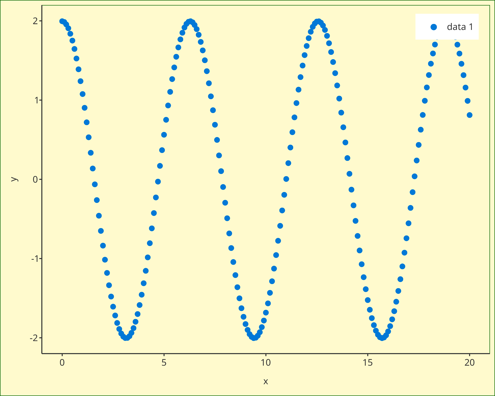

``` r
setBackgroundPanelArea(scatter1, fill = "lemonchiffon", color = "darkgreen", linetype = "solid")
```

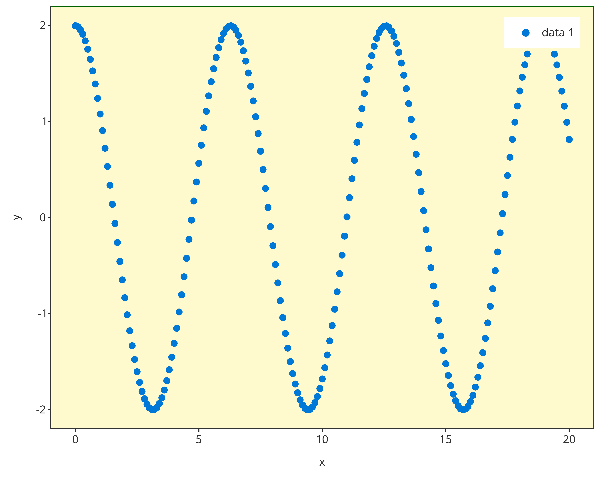

#### 3.3.2. Set Grid

The methods *setGrid*, *setXGrid*, and *setYGrid* are very similar and
require the plot object and the grid properties to be updated.

Using the previous example *scatter1*:

``` r
setGrid(scatter1, linetype = "blank")
```


``` r
setXGrid(scatter1, linetype = "blank")
```


``` r
setYGrid(scatter1, linetype = "blank")
```


#### 3.3.3. Set Watermark

The *setWatermark* method requires the plot object, the watermark, and
its properties to update.

Among its properties, the following are the few important ones:

- The property *alpha* is a value between 0 and 1 managing transparency
  of the watermark. The closer to 0, the more transparent the watermark
  will be. The closer to 1, the more opaque the watermark will be.
- The property *angle*, is the angle of the watermark in degrees.

Using the previous example *scatter1*:

``` r
setWatermark(scatter1, watermark = "Hello watermark !!")
```

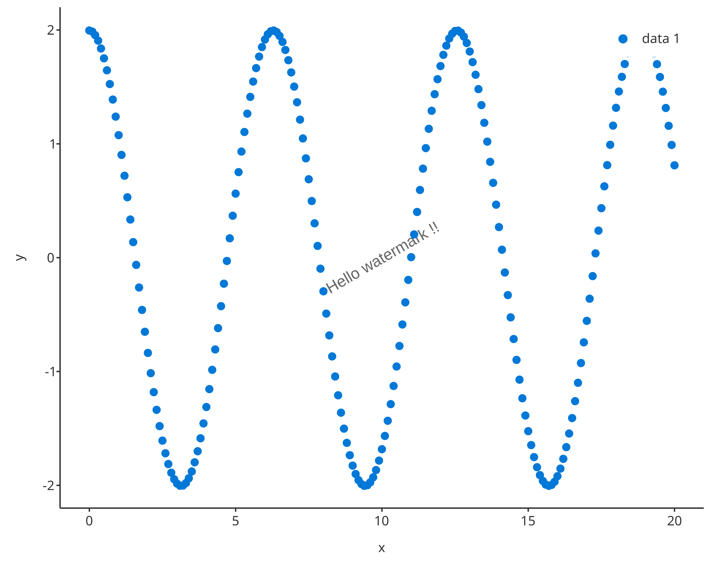

``` r
setWatermark(scatter1, watermark = "Confidential", angle = 45, size = 6, color = "firebrick")
```

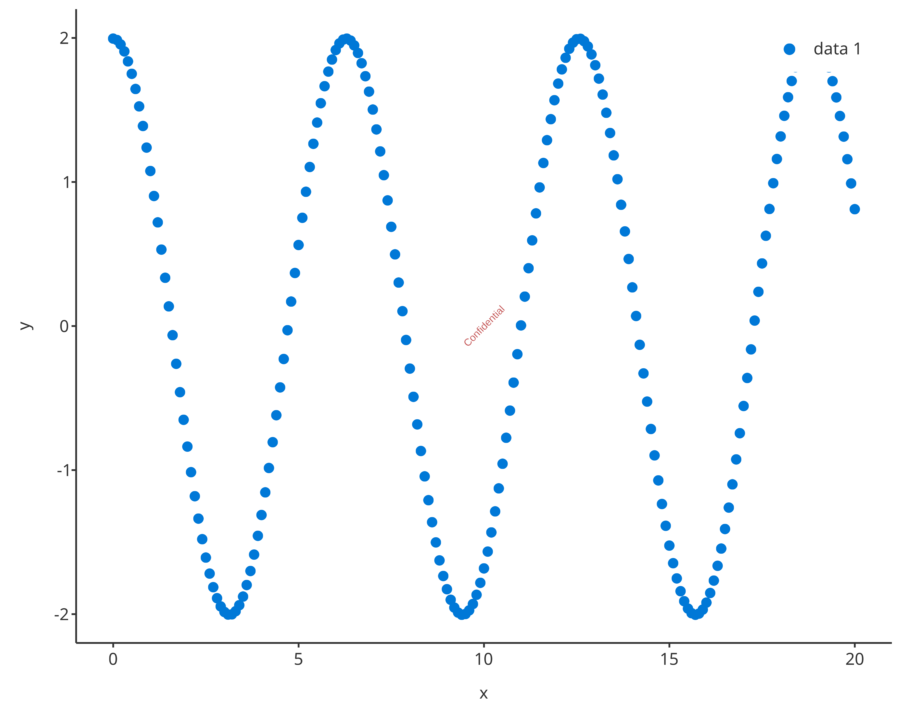

## 4. X/Y axes configurations: *xAxis*/*yAxis*

The fields *xAxis* and *yAxis* from the *PlotConfiguration* object are a
*XAxisConfiguration* and *YAxisConfiguration* R6 class objects. They
define the following plot properties:

- scale
- limits
- ticks
- ticklabels
- font

The property *scale* is a character string corresponding the axis scale.
Available scales are *“identity”, “lin”, “log”, “ln”, “discrete”,
“reverse”, “sqrt”, “time”, “date”* and can be accessed using the enum
*Scaling*. The property *limits* is a vector defining the range of the
axis.

Regarding ticks and ticklabels, their values are directly be passed on
and managed by `ggplot2`. The value *“default”* will leave the
management of the limits to R. The properties *ticks* and *ticklabels*
are vectors defining the plot ticks and their labels. These vectors are
required to have the same length. The value *“default”* will leave the
management of the limits to R.

When initializing a *XAxisConfiguration*, *YAxisConfiguration*, or
*PlotConfiguration* objects, the axis properties can be passed on.

``` r
myAxisConfiguration <- XAxisConfiguration$new()

myAxisConfiguration$scale
#> [1] "identity"
myAxisConfiguration$ticklabels
#> list()
#> attr(,"class")
#> [1] "waiver"
```

### 4.1. Axis configuration in plots

### Changing axis properties

The methods *setXAxis* and *setYAxis* require the plot object, and the
axis properties to update. Using the previous example, *scatter1*:

``` r
setXAxis(scatter1, axisLimits = c(0.5, 20), scale = Scaling$sqrt)
```

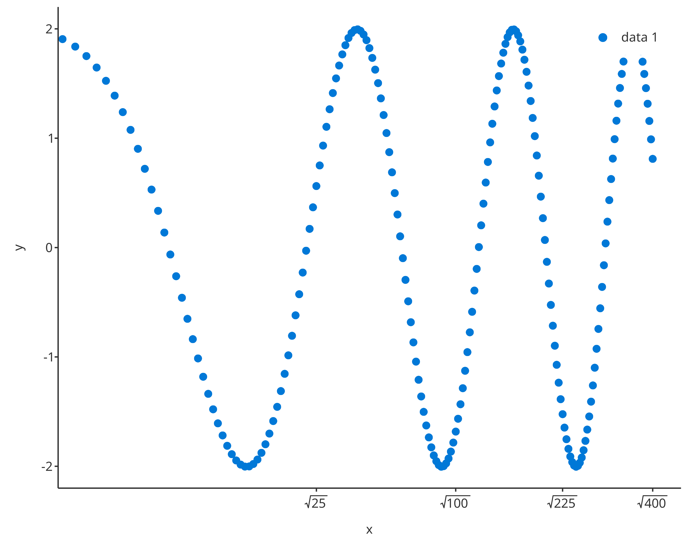

``` r
setXAxis(scatter1,
  axisLimits = c(0, 6 * pi),
  ticks = seq(0, 6 * pi, pi),
  ticklabels = TickLabelTransforms$pi,
  font = Font$new(color = "dodgerblue")
)
```

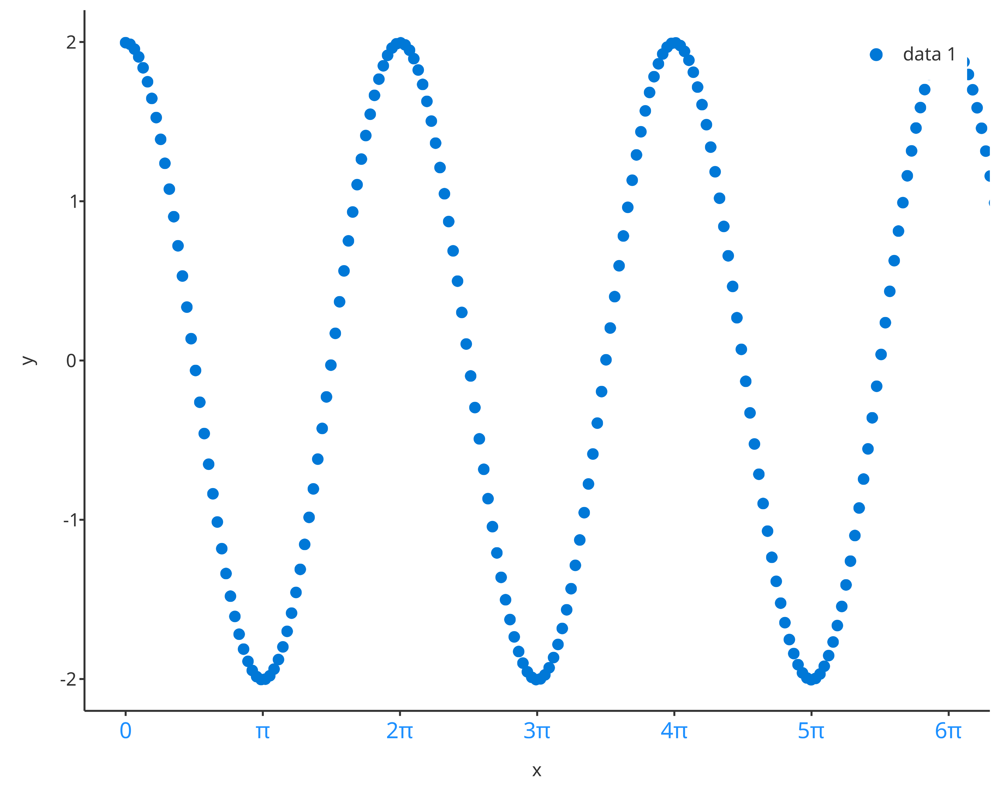

## 5. Legend configuration: *legend*

The field *legend* from the *PlotConfiguration* object is a
*LegendConfiguration* R6 class object. It defines the following plot
properties:

- title
- position
- caption

The property *title* is a character string corresponding the legend
title. The property *position* is a character string corresponding the
legend position. Available legend positions are *“none”, “insideTop”,
“insideTopLeft”, “insideLeft”, “insideBottomLeft”, “insideBottom”,
“insideBottomRight”, “insideRight”, “insideTopRight”, “outsideTop”,
“outsideTopLeft”, “outsideLeft”, “outsideBottomLeft”, “outsideBottom”,
“outsideBottomRight”, “outsideRight”, “outsideTopRight”* and can be
accessed using the enum *LegendPositions*. The property *caption* is a
data.frame defining the caption properties of the legend.

``` r
myLegend <- LegendConfiguration$new(position = LegendPositions$insideTopRight)
```

### 5.1. Legend configuration in plots

Legend position can be modified using the function `setLegendPosition`
The methods *setLegendPosition* requires the plot object, and the
position as defined by the elements of the enum *LegendPositions* Using
the previous example, *scatter1*:

``` r
setLegendPosition(scatter1, LegendPositions$insideTopLeft)
```

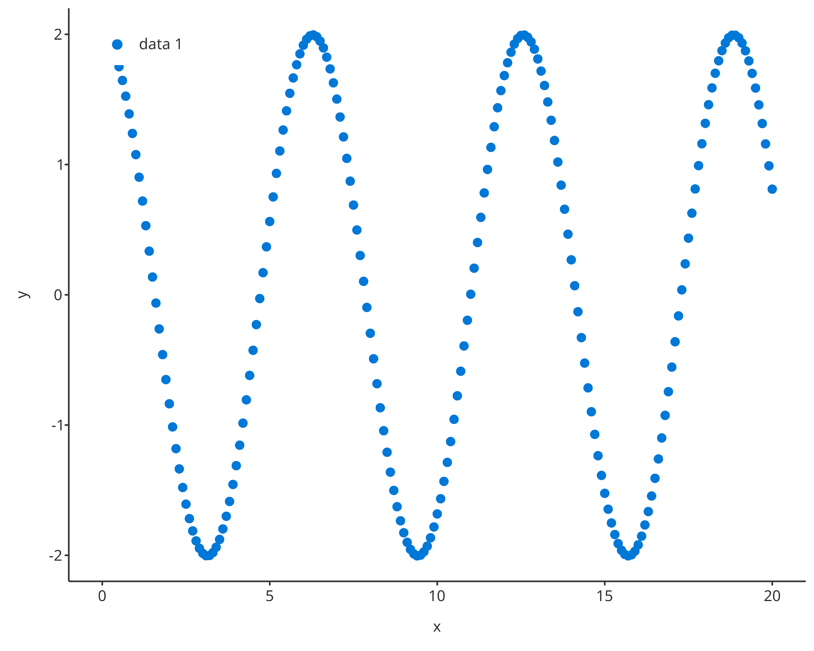

## 6. Default plot configuration: `Theme` objects

The class `Theme` allows a user-friendly way to set many default plot
settings. To allow a smooth way to set and update themes, themes
snapshots can be saved to json files using the function
`saveThemeToJson(theme)` and can be loaded from json files using the
function `loadThemeFromJson(jsonFile)`. In order to define a theme as
the current default, the function `useTheme(theme)` needs to be called.

A shiny app has been created to tune `Theme` objects live and save them
as json files. With this app, it becomes quite easy to create one’s own
theme with a few clicks. To call for the shiny app, users only needed to
run the function
[`runThemeMaker()`](https://www.open-systems-pharmacology.org/TLF-Library/reference/runThemeMaker.md).

Additionally, a few predefined themes are available :

``` r
list.files(system.file("themes", package = "tlf"))
#> [1] "dark-theme.json"     "excel-theme.json"    "hc-theme.json"      
#> [4] "matlab-theme.json"   "minimal-theme.json"  "template-theme.json"
```

These predefined themes can be directly loaded and used through
functions named `use<ThemeName>Theme()`. For instance, the function
[`useMatlabTheme()`](https://www.open-systems-pharmacology.org/TLF-Library/reference/useMatlabTheme.md)
will set default plot configurations for creating plots looking like
Matlab figures.

## 7. Exporting/Saving a plot

The function `exportPlot` is a wrapper around the function `ggsave` that
uses the properties of the field `export` in PlotConfiguration objects
when saving a plot as a file.

Since `ggsave` uses the full plot area as the plot dimensions to save,
big legends can shrink the size of the panel. To prevent such shrinkage,
plot dimensions can be updated before using `exportPlot` with the
function `updateExportDimensionsForLegend` as illustrated below.

``` r
scatterLegend <- setLegendPosition(scatter1, LegendPositions$outsideTop)
# Print properties of plot export
scatterLegend$plotConfiguration$export
#> Format: png
#> Width: 16 cm
#> Height: 9 cm
#> Resolution: 300 dots per inch
```

``` r
updatedScatterLegend <- updateExportDimensionsForLegend(scatterLegend)
# Print properties of plot export
updatedScatterLegend$plotConfiguration$export
#> Format: png
#> Width: 16 cm
#> Height: 9.99620578386606 cm
#> Resolution: 300 dots per inch
```

### Export code to re-create a PlotConfiguration object

The function `exportPlotConfigurationCode(plotConfiguration, name)`
creates character strings corresponding to commented R code that allows
you to re-create a PlotConfiguration object.

``` r
# Create and export a plot confiugration
plotConfigurationToExport1 <- PlotConfiguration$new()
exportPlotConfigurationCode(plotConfigurationToExport1)
#>   [1] "# Initialize the PlotConfiguration object"                           
#>   [2] "plotConfiguration <- PlotConfiguration$new()"                        
#>   [3] "\n"                                                                  
#>   [4] "# Define/Overwrite PlotConfiguration labels properties"              
#>   [5] "plotConfiguration$labels$title$text <- NULL"                         
#>   [6] "plotConfiguration$labels$title$font$color <- \"grey20\""             
#>   [7] "plotConfiguration$labels$title$font$size <- 12"                      
#>   [8] "plotConfiguration$labels$title$font$fontFace <- \"plain\""           
#>   [9] "plotConfiguration$labels$title$font$angle <- 0"                      
#>  [10] "plotConfiguration$labels$subtitle$text <- NULL"                      
#>  [11] "plotConfiguration$labels$subtitle$font$color <- \"grey20\""          
#>  [12] "plotConfiguration$labels$subtitle$font$size <- 10"                   
#>  [13] "plotConfiguration$labels$subtitle$font$fontFace <- \"plain\""        
#>  [14] "plotConfiguration$labels$subtitle$font$angle <- 0"                   
#>  [15] "plotConfiguration$labels$xlabel$text <- NULL"                        
#>  [16] "plotConfiguration$labels$xlabel$font$color <- \"grey20\""            
#>  [17] "plotConfiguration$labels$xlabel$font$size <- 10"                     
#>  [18] "plotConfiguration$labels$xlabel$font$fontFace <- \"plain\""          
#>  [19] "plotConfiguration$labels$xlabel$font$angle <- 0"                     
#>  [20] "plotConfiguration$labels$ylabel$text <- NULL"                        
#>  [21] "plotConfiguration$labels$ylabel$font$color <- \"grey20\""            
#>  [22] "plotConfiguration$labels$ylabel$font$size <- 10"                     
#>  [23] "plotConfiguration$labels$ylabel$font$fontFace <- \"plain\""          
#>  [24] "plotConfiguration$labels$ylabel$font$angle <- 90"                    
#>  [25] "\n"                                                                  
#>  [26] "# Define/Overwrite PlotConfiguration background properties"          
#>  [27] "plotConfiguration$background$watermark$text <- \"\""                 
#>  [28] "plotConfiguration$background$watermark$font$color <- \"grey20\""     
#>  [29] "plotConfiguration$background$watermark$font$size <- 12"              
#>  [30] "plotConfiguration$background$watermark$font$fontFace <- \"plain\""   
#>  [31] "plotConfiguration$background$watermark$font$angle <- 30"             
#>  [32] "plotConfiguration$background$plot$color <- \"grey20\""               
#>  [33] "plotConfiguration$background$plot$size <- 0.5"                       
#>  [34] "plotConfiguration$background$plot$linetype <- \"blank\""             
#>  [35] "plotConfiguration$background$plot$fill <- \"white\""                 
#>  [36] "plotConfiguration$background$panel$color <- \"grey20\""              
#>  [37] "plotConfiguration$background$panel$size <- \"0.5\""                  
#>  [38] "plotConfiguration$background$panel$linetype <- \"blank\""            
#>  [39] "plotConfiguration$background$panel$fill <- \"white\""                
#>  [40] "plotConfiguration$background$xAxis$color <- \"grey20\""              
#>  [41] "plotConfiguration$background$xAxis$size <- \"0.5\""                  
#>  [42] "plotConfiguration$background$xAxis$linetype <- \"solid\""            
#>  [43] "plotConfiguration$background$xAxis$fill <- NULL"                     
#>  [44] "plotConfiguration$background$yAxis$color <- \"grey20\""              
#>  [45] "plotConfiguration$background$yAxis$size <- \"0.5\""                  
#>  [46] "plotConfiguration$background$yAxis$linetype <- \"solid\""            
#>  [47] "plotConfiguration$background$yAxis$fill <- NULL"                     
#>  [48] "plotConfiguration$background$xGrid$color <- \"grey20\""              
#>  [49] "plotConfiguration$background$xGrid$size <- \"0.5\""                  
#>  [50] "plotConfiguration$background$xGrid$linetype <- \"blank\""            
#>  [51] "plotConfiguration$background$xGrid$fill <- NULL"                     
#>  [52] "plotConfiguration$background$yGrid$color <- \"grey20\""              
#>  [53] "plotConfiguration$background$yGrid$size <- \"0.5\""                  
#>  [54] "plotConfiguration$background$yGrid$linetype <- \"blank\""            
#>  [55] "plotConfiguration$background$yGrid$fill <- NULL"                     
#>  [56] "\n"                                                                  
#>  [57] "# Define/Overwrite PlotConfiguration axes properties"                
#>  [58] "plotConfiguration$xAxis$font$color <- \"grey20\""                    
#>  [59] "plotConfiguration$xAxis$font$size <- 10"                             
#>  [60] "plotConfiguration$xAxis$font$fontFace <- \"plain\""                  
#>  [61] "plotConfiguration$xAxis$font$angle <- 0"                             
#>  [62] "plotConfiguration$xAxis$valuesLimits <- NULL"                        
#>  [63] "plotConfiguration$xAxis$axisLimits <- NULL"                          
#>  [64] "plotConfiguration$xAxis$scale <- \"identity\""                       
#>  [65] "plotConfiguration$xAxis$ticklabels <- NULL"                          
#>  [66] "plotConfiguration$xAxis$ticks <- NULL"                               
#>  [67] "plotConfiguration$yAxis$font$color <- \"grey20\""                    
#>  [68] "plotConfiguration$yAxis$font$size <- 10"                             
#>  [69] "plotConfiguration$yAxis$font$fontFace <- \"plain\""                  
#>  [70] "plotConfiguration$yAxis$font$angle <- 0"                             
#>  [71] "plotConfiguration$yAxis$valuesLimits <- NULL"                        
#>  [72] "plotConfiguration$yAxis$axisLimits <- NULL"                          
#>  [73] "plotConfiguration$yAxis$scale <- \"identity\""                       
#>  [74] "plotConfiguration$yAxis$ticklabels <- NULL"                          
#>  [75] "plotConfiguration$yAxis$ticks <- NULL"                               
#>  [76] "\n"                                                                  
#>  [77] "# Define/Overwrite PlotConfiguration legend properties"              
#>  [78] "plotConfiguration$legend$position <- \"insideTopRight\""             
#>  [79] "plotConfiguration$legend$background$fill <- \"white\""               
#>  [80] "plotConfiguration$legend$background$color <- \"white\""              
#>  [81] "plotConfiguration$legend$background$size <- \"0.5\""                 
#>  [82] "plotConfiguration$legend$background$linetype <- \"blank\""           
#>  [83] "plotConfiguration$legend$title$text <- NULL"                         
#>  [84] "plotConfiguration$legend$title$font$color <- \"black\""              
#>  [85] "plotConfiguration$legend$title$font$size <- 14"                      
#>  [86] "plotConfiguration$legend$title$font$fontFace <- \"plain\""           
#>  [87] "plotConfiguration$legend$title$font$angle <- 0"                      
#>  [88] "plotConfiguration$legend$font$color <- \"grey20\""                   
#>  [89] "plotConfiguration$legend$font$size <- 10"                            
#>  [90] "plotConfiguration$legend$font$fontFace <- \"plain\""                 
#>  [91] "plotConfiguration$legend$font$angle <- 0"                            
#>  [92] "\n"                                                                  
#>  [93] "# Define/Overwrite PlotConfiguration aesthetics selection properties"
#>  [94] "plotConfiguration$points$color <- \"next\""                          
#>  [95] "plotConfiguration$points$size <- 3"                                  
#>  [96] "plotConfiguration$points$linetype <- \"blank\""                      
#>  [97] "plotConfiguration$points$shape <- \"next\""                          
#>  [98] "plotConfiguration$points$fill <- \"NA\""                             
#>  [99] "plotConfiguration$points$alpha <- 1"                                 
#> [100] "plotConfiguration$lines$color <- \"next\""                           
#> [101] "plotConfiguration$lines$size <- \"first\""                           
#> [102] "plotConfiguration$lines$linetype <- \"same\""                        
#> [103] "plotConfiguration$lines$shape <- \"blank\""                          
#> [104] "plotConfiguration$lines$fill <- \"NA\""                              
#> [105] "plotConfiguration$lines$alpha <- 1"                                  
#> [106] "plotConfiguration$ribbons$color <- \"next\""                         
#> [107] "plotConfiguration$ribbons$size <- \"first\""                         
#> [108] "plotConfiguration$ribbons$linetype <- \"same\""                      
#> [109] "plotConfiguration$ribbons$shape <- \"blank\""                        
#> [110] "plotConfiguration$ribbons$fill <- \"next\""                          
#> [111] "plotConfiguration$ribbons$alpha <- \"first\""                        
#> [112] "plotConfiguration$errorbars$color <- \"next\""                       
#> [113] "plotConfiguration$errorbars$size <- \"first\""                       
#> [114] "plotConfiguration$errorbars$linetype <- \"first\""                   
#> [115] "plotConfiguration$errorbars$shape <- \"blank\""                      
#> [116] "plotConfiguration$errorbars$fill <- \"NA\""                          
#> [117] "plotConfiguration$errorbars$alpha <- 1"                              
#> [118] "\n"                                                                  
#> [119] "# Define/Overwrite PlotConfiguration export properties"              
#> [120] "plotConfiguration$export$name <- \"figure\""                         
#> [121] "plotConfiguration$export$format <- \"png\""                          
#> [122] "plotConfiguration$export$width <- 16"                                
#> [123] "plotConfiguration$export$height <- 9"                                
#> [124] "plotConfiguration$export$units <- \"cm\""                            
#> [125] "plotConfiguration$export$dpi <- 300"                                 
#> [126] "\n"

# Create, update and export a more advanced plot confiugration
plotConfigurationToExport2 <- TornadoPlotConfiguration$new(bar = FALSE)
exportPlotConfigurationCode(plotConfigurationToExport2, name = "tornado")
#>   [1] "# Initialize the PlotConfiguration object"                           
#>   [2] "tornado <- TornadoPlotConfiguration$new()"                           
#>   [3] "\n"                                                                  
#>   [4] "# Define/Overwrite PlotConfiguration labels properties"              
#>   [5] "tornado$labels$title$text <- NULL"                                   
#>   [6] "tornado$labels$title$font$color <- \"grey20\""                       
#>   [7] "tornado$labels$title$font$size <- 12"                                
#>   [8] "tornado$labels$title$font$fontFace <- \"plain\""                     
#>   [9] "tornado$labels$title$font$angle <- 0"                                
#>  [10] "tornado$labels$subtitle$text <- NULL"                                
#>  [11] "tornado$labels$subtitle$font$color <- \"grey20\""                    
#>  [12] "tornado$labels$subtitle$font$size <- 10"                             
#>  [13] "tornado$labels$subtitle$font$fontFace <- \"plain\""                  
#>  [14] "tornado$labels$subtitle$font$angle <- 0"                             
#>  [15] "tornado$labels$xlabel$text <- NULL"                                  
#>  [16] "tornado$labels$xlabel$font$color <- \"grey20\""                      
#>  [17] "tornado$labels$xlabel$font$size <- 10"                               
#>  [18] "tornado$labels$xlabel$font$fontFace <- \"plain\""                    
#>  [19] "tornado$labels$xlabel$font$angle <- 0"                               
#>  [20] "tornado$labels$ylabel$text <- NULL"                                  
#>  [21] "tornado$labels$ylabel$font$color <- \"grey20\""                      
#>  [22] "tornado$labels$ylabel$font$size <- 10"                               
#>  [23] "tornado$labels$ylabel$font$fontFace <- \"plain\""                    
#>  [24] "tornado$labels$ylabel$font$angle <- 90"                              
#>  [25] "\n"                                                                  
#>  [26] "# Define/Overwrite PlotConfiguration background properties"          
#>  [27] "tornado$background$watermark$text <- \"\""                           
#>  [28] "tornado$background$watermark$font$color <- \"grey20\""               
#>  [29] "tornado$background$watermark$font$size <- 12"                        
#>  [30] "tornado$background$watermark$font$fontFace <- \"plain\""             
#>  [31] "tornado$background$watermark$font$angle <- 30"                       
#>  [32] "tornado$background$plot$color <- \"grey20\""                         
#>  [33] "tornado$background$plot$size <- 0.5"                                 
#>  [34] "tornado$background$plot$linetype <- \"blank\""                       
#>  [35] "tornado$background$plot$fill <- \"white\""                           
#>  [36] "tornado$background$panel$color <- \"grey20\""                        
#>  [37] "tornado$background$panel$size <- \"0.5\""                            
#>  [38] "tornado$background$panel$linetype <- \"blank\""                      
#>  [39] "tornado$background$panel$fill <- \"white\""                          
#>  [40] "tornado$background$xAxis$color <- \"grey20\""                        
#>  [41] "tornado$background$xAxis$size <- \"0.5\""                            
#>  [42] "tornado$background$xAxis$linetype <- \"solid\""                      
#>  [43] "tornado$background$xAxis$fill <- NULL"                               
#>  [44] "tornado$background$yAxis$color <- \"grey20\""                        
#>  [45] "tornado$background$yAxis$size <- \"0.5\""                            
#>  [46] "tornado$background$yAxis$linetype <- \"solid\""                      
#>  [47] "tornado$background$yAxis$fill <- NULL"                               
#>  [48] "tornado$background$xGrid$color <- \"grey20\""                        
#>  [49] "tornado$background$xGrid$size <- \"0.5\""                            
#>  [50] "tornado$background$xGrid$linetype <- \"blank\""                      
#>  [51] "tornado$background$xGrid$fill <- NULL"                               
#>  [52] "tornado$background$yGrid$color <- \"grey20\""                        
#>  [53] "tornado$background$yGrid$size <- \"0.5\""                            
#>  [54] "tornado$background$yGrid$linetype <- \"blank\""                      
#>  [55] "tornado$background$yGrid$fill <- NULL"                               
#>  [56] "\n"                                                                  
#>  [57] "# Define/Overwrite PlotConfiguration axes properties"                
#>  [58] "tornado$xAxis$font$color <- \"grey20\""                              
#>  [59] "tornado$xAxis$font$size <- 10"                                       
#>  [60] "tornado$xAxis$font$fontFace <- \"plain\""                            
#>  [61] "tornado$xAxis$font$angle <- 0"                                       
#>  [62] "tornado$xAxis$valuesLimits <- NULL"                                  
#>  [63] "tornado$xAxis$axisLimits <- NULL"                                    
#>  [64] "tornado$xAxis$scale <- \"identity\""                                 
#>  [65] "tornado$xAxis$ticklabels <- NULL"                                    
#>  [66] "tornado$xAxis$ticks <- NULL"                                         
#>  [67] "tornado$yAxis$font$color <- \"grey20\""                              
#>  [68] "tornado$yAxis$font$size <- 10"                                       
#>  [69] "tornado$yAxis$font$fontFace <- \"plain\""                            
#>  [70] "tornado$yAxis$font$angle <- 0"                                       
#>  [71] "tornado$yAxis$valuesLimits <- NULL"                                  
#>  [72] "tornado$yAxis$axisLimits <- NULL"                                    
#>  [73] "tornado$yAxis$scale <- \"discrete\""                                 
#>  [74] "tornado$yAxis$ticklabels <- NULL"                                    
#>  [75] "tornado$yAxis$ticks <- NULL"                                         
#>  [76] "\n"                                                                  
#>  [77] "# Define/Overwrite PlotConfiguration legend properties"              
#>  [78] "tornado$legend$position <- \"insideTopRight\""                       
#>  [79] "tornado$legend$background$fill <- \"white\""                         
#>  [80] "tornado$legend$background$color <- \"white\""                        
#>  [81] "tornado$legend$background$size <- \"0.5\""                           
#>  [82] "tornado$legend$background$linetype <- \"blank\""                     
#>  [83] "tornado$legend$title$text <- NULL"                                   
#>  [84] "tornado$legend$title$font$color <- \"black\""                        
#>  [85] "tornado$legend$title$font$size <- 14"                                
#>  [86] "tornado$legend$title$font$fontFace <- \"plain\""                     
#>  [87] "tornado$legend$title$font$angle <- 0"                                
#>  [88] "tornado$legend$font$color <- \"grey20\""                             
#>  [89] "tornado$legend$font$size <- 10"                                      
#>  [90] "tornado$legend$font$fontFace <- \"plain\""                           
#>  [91] "tornado$legend$font$angle <- 0"                                      
#>  [92] "\n"                                                                  
#>  [93] "# Define/Overwrite PlotConfiguration aesthetics selection properties"
#>  [94] "tornado$points$color <- \"reset\""                                   
#>  [95] "tornado$points$size <- 3"                                            
#>  [96] "tornado$points$linetype <- \"blank\""                                
#>  [97] "tornado$points$shape <- \"reset\""                                   
#>  [98] "tornado$points$fill <- \"NA\""                                       
#>  [99] "tornado$points$alpha <- 1"                                           
#> [100] "tornado$lines$color <- \"grey20\""                                   
#> [101] "tornado$lines$size <- 0.5"                                           
#> [102] "tornado$lines$linetype <- \"longdash\""                              
#> [103] "tornado$lines$shape <- \"blank\""                                    
#> [104] "tornado$lines$fill <- \"NA\""                                        
#> [105] "tornado$lines$alpha <- 1"                                            
#> [106] "tornado$ribbons$color <- \"reset\""                                  
#> [107] "tornado$ribbons$size <- 0.5"                                         
#> [108] "tornado$ribbons$linetype <- \"solid\""                               
#> [109] "tornado$ribbons$shape <- \"blank\""                                  
#> [110] "tornado$ribbons$fill <- \"reset\""                                   
#> [111] "tornado$ribbons$alpha <- \"first\""                                  
#> [112] "tornado$errorbars$color <- \"reset\""                                
#> [113] "tornado$errorbars$size <- \"same\""                                  
#> [114] "tornado$errorbars$linetype <- \"first\""                             
#> [115] "tornado$errorbars$shape <- \"blank\""                                
#> [116] "tornado$errorbars$fill <- NA"                                        
#> [117] "tornado$errorbars$alpha <- 1"                                        
#> [118] "\n"                                                                  
#> [119] "# Define/Overwrite PlotConfiguration export properties"              
#> [120] "tornado$export$name <- \"figure\""                                   
#> [121] "tornado$export$format <- \"png\""                                    
#> [122] "tornado$export$width <- 16"                                          
#> [123] "tornado$export$height <- 9"                                          
#> [124] "tornado$export$units <- \"cm\""                                      
#> [125] "tornado$export$dpi <- 300"                                           
#> [126] "\n"                                                                  
#> [127] "# Define/Overwrite Pproperties specific to Tornado plots"            
#> [128] "tornado$bar <- FALSE"                                                
#> [129] "tornado$dodge <- 0.5"                                                
#> [130] "tornado$colorPalette <- NULL"
```

Since `exportPlotConfigurationCode` returns character strings, they can
either be saved as a .R script or copied/pasted to be used as is or
within a function. It is also possible to turn the strings into and
expression to `eval` using
`parse(text = exportPlotConfigurationCode(plotConfiguration))`.

``` r
eval(parse(text = exportPlotConfigurationCode(plotConfigurationToExport2, name = "tornado")))
tornado
#> <TornadoPlotConfiguration>
#>   Inherits from: <PlotConfiguration>
#>   Public:
#>     background: active binding
#>     bar: FALSE
#>     clone: function (deep = FALSE) 
#>     colorPalette: NULL
#>     defaultExpand: FALSE
#>     defaultSymmetricAxes: FALSE
#>     defaultXScale: lin
#>     defaultYScale: discrete
#>     dodge: 0.5
#>     errorbars: active binding
#>     export: ExportConfiguration, R6
#>     initialize: function (bar = TRUE, colorPalette = NULL, dodge = 0.5, ...) 
#>     labels: active binding
#>     legend: active binding
#>     lines: active binding
#>     points: active binding
#>     ribbons: active binding
#>     xAxis: active binding
#>     yAxis: active binding
#>   Private:
#>     .background: BackgroundConfiguration, R6
#>     .errorbars: ThemeAestheticSelections, ThemeAestheticMaps, R6
#>     .labels: LabelConfiguration, R6
#>     .legend: LegendConfiguration, R6
#>     .lines: ThemeAestheticSelections, ThemeAestheticMaps, R6
#>     .points: ThemeAestheticSelections, ThemeAestheticMaps, R6
#>     .ribbons: ThemeAestheticSelections, ThemeAestheticMaps, R6
#>     .xAxis: XAxisConfiguration, AxisConfiguration, R6
#>     .yAxis: YAxisConfiguration, AxisConfiguration, R6
```
