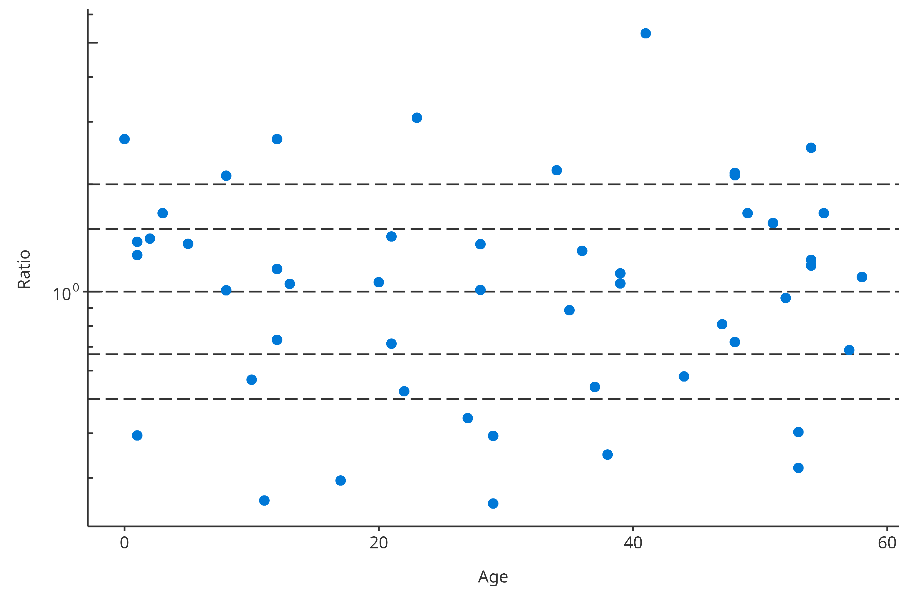
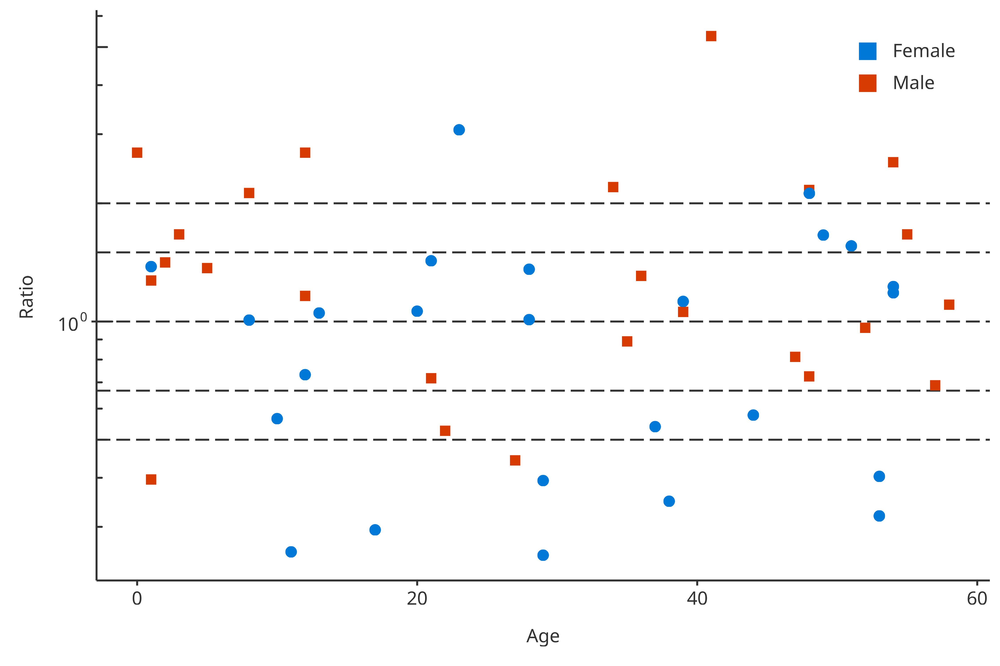
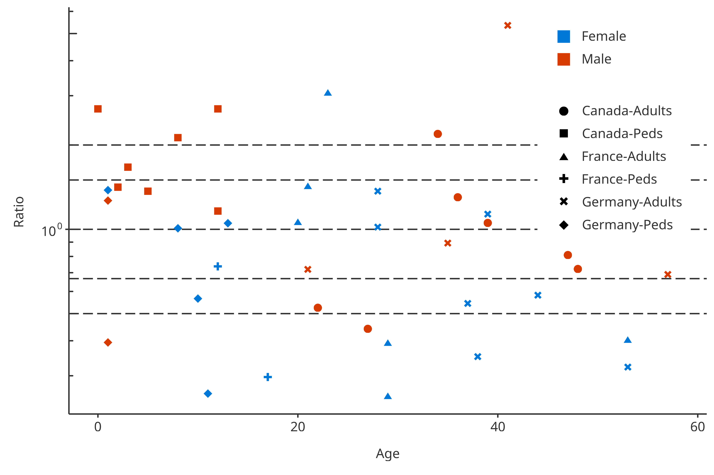
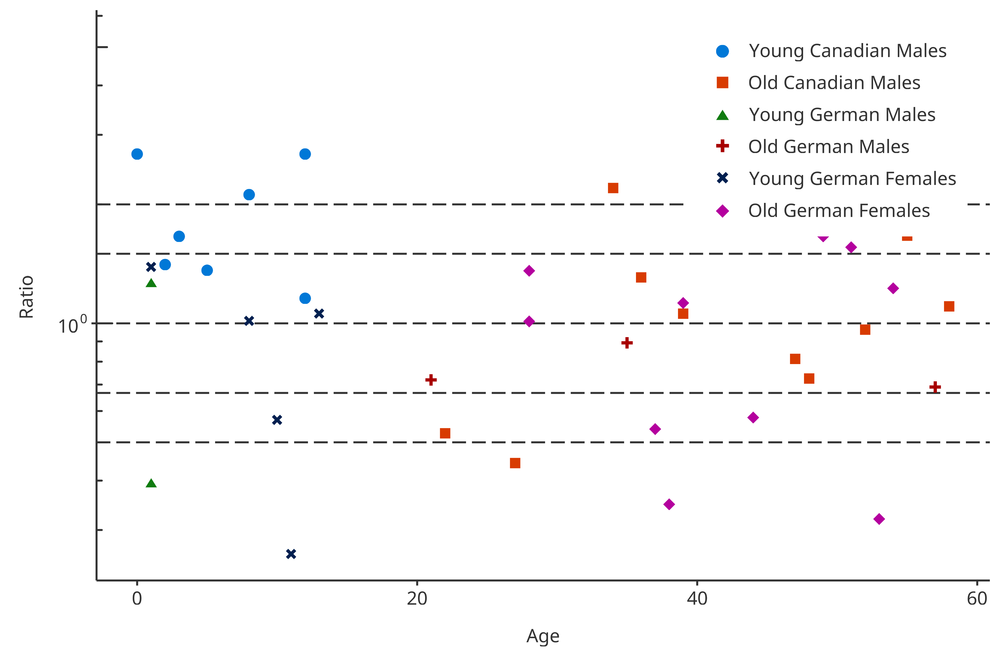
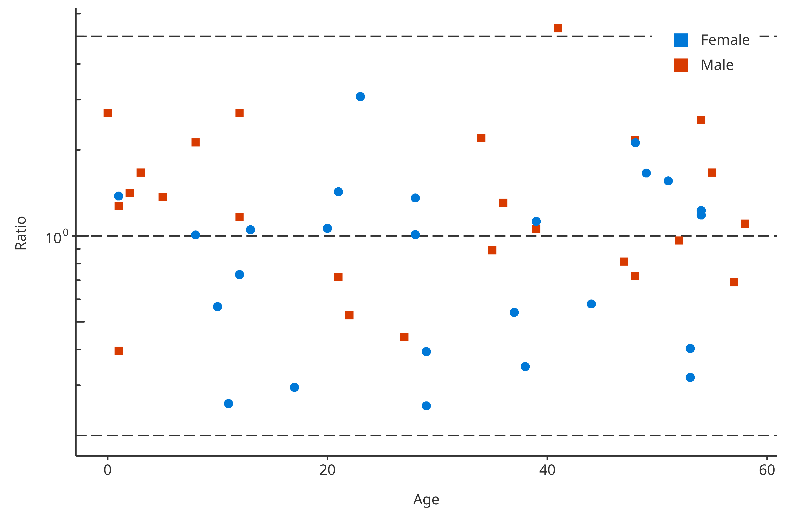

# PK Ratio Plots

``` r

require(tlf)
#> Loading required package: tlf
```

## 1. Introduction

The following vignette aims at documenting and illustrating workflows
for producing PK ratio plots using the `tlf`-Library.

This vignette focuses PK ratio plots examples. Detailed documentation on
typical `tlf` workflow, use of `AgregationSummary`, `DataMapping`,
`PlotConfiguration`, and `Theme` can be found in
`vignette("tlf-workflow")`.

## 2. Illustration of basic PK ratio plots

### 2.1. Data

The data showed in the sequel is available at the following path:
`system.file("extdata", "test-data.csv", package = "tlf")`. In the code
below, the data is loaded and assigned to `pkRatioData`.

``` r

# Load example
pkRatioData <- read.csv(
  system.file("extdata", "test-data.csv", package = "tlf"),
  stringsAsFactors = FALSE
)

# pkRatioData
knitr::kable(utils::head(pkRatioData), digits = 2)
```

|  ID | Age |  Obs | Pred | Ratio | AgeBin | Sex  | Country |   SD |
|----:|----:|-----:|-----:|------:|:-------|:-----|:--------|-----:|
|   1 |  48 | 4.00 | 2.90 |  0.72 | Adults | Male | Canada  | 0.69 |
|   2 |  36 | 4.40 | 5.75 |  1.31 | Adults | Male | Canada  | 0.19 |
|   3 |  52 | 2.80 | 2.70 |  0.96 | Adults | Male | Canada  | 0.98 |
|   4 |  47 | 3.75 | 3.05 |  0.81 | Adults | Male | Canada  | 0.59 |
|   5 |   0 | 1.95 | 5.25 |  2.69 | Peds   | Male | Canada  | 0.44 |
|   6 |  48 | 2.45 | 5.30 |  2.16 | Adults | Male | Canada  | 0.07 |

A list of information about `pkRatioData` can be provided through
`metaData`.

``` r

knitr::kable(data.frame(
  Variable = c("Age", "Obs", "Pred", "Ratio"),
  Dimension = c("Age", "Clearance", "Clearance", "Ratio"),
  Unit = c("yrs", "dL/h/kg", "dL/h/kg", "")
))
```

| Variable | Dimension | Unit    |
|:---------|:----------|:--------|
| Age      | Age       | yrs     |
| Obs      | Clearance | dL/h/kg |
| Pred     | Clearance | dL/h/kg |
| Ratio    | Ratio     |         |

### 2.2. `plotPKRatio`

The function plotting PK ratios is:
[`plotPKRatio()`](https://www.open-systems-pharmacology.org/TLF-Library/dev/reference/plotPKRatio.md).
Basic documentation of the function can be found using:
[`?plotPKRatio`](https://www.open-systems-pharmacology.org/TLF-Library/dev/reference/plotPKRatio.md).
The typical usage of this function is:
`plotPKRatio(data, metaData = NULL, dataMapping = NULL, plotConfiguration = NULL)`.
The output of the function is a `ggplot` object. It can be seen from
this usage that only `data` is a necessary input. Default set ups are
used for `metaData`, `dataMapping` and `plotConfiguration` within the
call of `plotPKRatio`. For instance, if `dataMapping` is not provided,
smart mapping will check if data contains `"x"` and `"y"` columns. If
the `data` has only two columns not named `"x"` and `"y"`, it will
assume the first one should be plot in x-axis and the second in y-axis.
Then, `PKRatioPlotConfiguration` is initialized if not provided,
defining a standard configuration with `PK Ratio Plot` as title, the
current date as subtitle and using predefined fonts as defined by the
current theme.

### 2.3. Minimal example

The minimal example can work using directly the function
`plotPKRatio(data = pkRatioData[, c("Age", "Ratio")])`.

``` r

plotPKRatio(data = pkRatioData[, c("Age", "Ratio")])
```



### 2.4. Examples with `dataMapping`

For PK ratio, the `dataMapping` class `PKRatioDataMapping` includes 4
fields: `x`, `y`, `groupMapping` and `lines`. `x` and `y` define which
variables from the data will be plotted in X- and Y-axes, `groupMapping`
is a class mapping which aesthetic property will split which variables,
and `lines` defines horizontal lines performed in PK ratio plots.

#### 2.4.1 `groupMapping`

Some variables can be used to cluster the data. To this end,
*PKRatioDataMapping* objects include *GroupMapping* objects that can
define how to cluster based on a variable or a data.frame. As
illustrated below, most of the time, the direct input of `color` and
`shape` is faster to define such objects. Consequently, the following
examples are identical:

``` r

# Two-step process
colorMapping <- GroupMapping$new(color = "Sex")
dataMappingA <- PKRatioDataMapping$new(
  x = "Age",
  y = "Ratio",
  groupMapping = colorMapping
)

print(dataMappingA$groupMapping$color$label)
#> [1] "Sex"

# One-step process
dataMappingB <- PKRatioDataMapping$new(
  x = "Age",
  y = "Ratio",
  color = "Sex"
)

print(dataMappingB$groupMapping$color$label)
#> [1] "Sex"
```

Then, in this example, `plotPKRatio` can use the groupMapping to split
the data by “Gender” and associate different colors to each “Gender”:

``` r

plotPKRatio(
  data = pkRatioData,
  dataMapping = dataMappingB
)
```



Multiple groupMappings can be performed for PK ratio: data can be
regrouped by `color`, `shape` and/or `size`. The next example uses 2
groups in the groupMapping: One group splits “Gender” by `color`, the
other splits `shape` by “Amount” and “Compound”.

``` r

dataMapping2groups <- PKRatioDataMapping$new(
  x = "Age",
  y = "Ratio",
  color = "Sex",
  shape = c("Country", "AgeBin")
)
plotPKRatio(
  data = pkRatioData,
  dataMapping = dataMapping2groups
)
```



The last examples uses another feature available in the `groupMapping`
class. The class can be initialized using a `data.frame` where the last
column of the data.frame will be used to split the data. In the
following example, the data.frame is the following:

| AgeBin | Country | Sex    | Group                  |
|:-------|:--------|:-------|:-----------------------|
| Peds   | Canada  | Male   | Young Canadian Males   |
| Adults | Canada  | Male   | Old Canadian Males     |
| Peds   | Germany | Male   | Young German Males     |
| Adults | Germany | Male   | Old German Males       |
| Peds   | France  | Male   | Young French Males     |
| Adults | France  | Male   | Old French Males       |
| Peds   | Canada  | Female | Young Canadian Females |
| Adults | Canada  | Female | Old Canadian Females   |
| Peds   | Germany | Female | Young German Females   |
| Adults | Germany | Female | Old German Females     |
| Peds   | France  | Female | Young French Females   |
| Adults | France  | Female | Old French Females     |

The `dataMapping` introduced below will split the `color` and `shape`
using the data frame.

``` r

dataMappingDF <- PKRatioDataMapping$new(
  x = "Age",
  y = "Ratio",
  color = groupDataFrame,
  shape = groupDataFrame
)
plotPKRatio(
  data = pkRatioData[!(pkRatioData$Country %in% "France"), ],
  dataMapping = dataMappingDF
)
```



#### 2.4.2 PK values defined in `lines`

In PK ratio examples, usually horizontal lines are added allowing to
flag values in and out of the \[0.67-1.5\] as well as \[0.5-2.0\]
ranges. The value mapping these horizontal lines was predefined as a
list: “pkRatioLine1” is 1, “pkRatioLine2” is c(0.67, 1.5) and
“pkRatioLine3” is c(0.5, 2). Consequently, for any default
`PKRatioDataMapping`, you have:

``` r

linesMapping <- PKRatioDataMapping$new()
linesMapping$lines
#> $pkRatio1
#> [1] 1
#> 
#> $pkRatio2
#> [1] 1.5000000 0.6666667
#> 
#> $pkRatio3
#> [1] 2.0 0.5
```

Overwriting these value is possible by updating the value either when
initializing the mapping or afterwards. For instance:

``` r

linesMapping <- PKRatioDataMapping$new(
  lines = list(pkRatio1 = 1, pkRatio2 = c(0.2, 5)),
  x = "Age",
  y = "Ratio",
  color = "Sex"
)
plotPKRatio(
  data = pkRatioData,
  dataMapping = linesMapping
)
```



### 2.5. Qualification of PK Ratios

The qualification of the PK Ratios can be performed using
`getPKRatioMeasure`. This function return a `data.frame` with the PK
ratios within specific ranges. As a default, these ranges are within 1.5
and 2 folds. However, they can be updated using the option
`ratioLimits =` when running the function.

``` r

# Test of getPKRatioMeasure
PKRatioMeasure <- getPKRatioMeasure(data = pkRatioData[, c("Age", "Ratio")])

knitr::kable(
  x = PKRatioMeasure,
  caption = "Qualification of PK Ratios"
)
```

|                        | Number | Ratio |
|:-----------------------|-------:|------:|
| Points Total           |     50 |    NA |
| Points within 1.5-fold |     24 |  0.48 |
| Points within 2-fold   |     32 |  0.64 |

Qualification of PK Ratios {.table}

### 2.6. Plot Configuration

To configure the plot properties, `PKRatioPlotConfiguration` objects can
be used. They combine multiple features that set the plot properties. PK
ratio plot consists in *lines* and *points*. As illustrated in the
vignette related to *PlotConfiguration* objects and *Theme*, you can
tune the aesthetic maps and their selections (see
[`vignette("plot-configuration")`](https://www.open-systems-pharmacology.org/TLF-Library/dev/articles/plot-configuration.md)
and
[`vignette("theme-maker")`](https://www.open-systems-pharmacology.org/TLF-Library/dev/articles/theme-maker.md)).
Colors, shapes and size of the PK ratio scatter points can be tuned in
the plotConfiguration *points* field. Likewise, colors, linetype and
size of the PK ratio lines can be tuned in the plotConfiguration *lines*
field.
