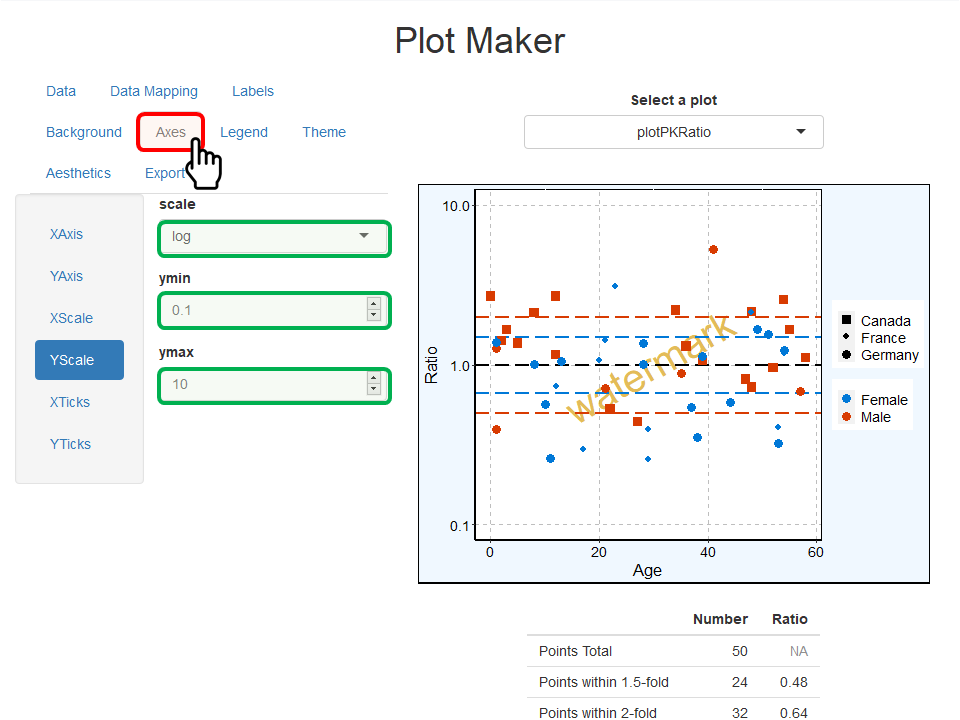
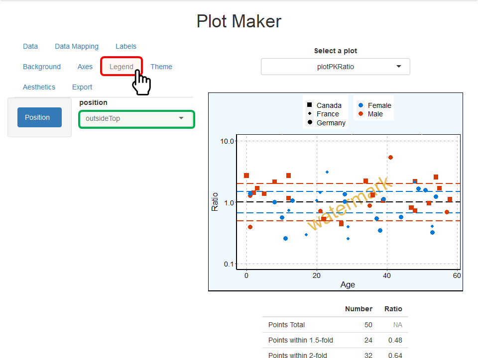

```{r, include = FALSE}
knitr::opts_chunk$set(
  collapse = TRUE,
  comment = "#>",
  out.width = "100%",
  include = TRUE,
  fig.align = "center",
  echo = FALSE
)
```

```{r setup}
require(tlf)
```

# 1. Introduction

The aim of this vignette is to document how to create plots using the `tlf` user interface (UI) called by **`runPlotMaker()`**.

# 2. How to start

Use the function `runPlotMaker()` to start the User Interface. The function will load `shiny` required for the UI.

```{r start-plot-maker}
knitr::include_graphics("figures/plot-maker/start-plot-maker.png")
```

# 3. How to import data

In the navigation bar **Data**, the first field named **Location** allows two ways of importing data: *environment* and *file*.

Data can be directly taken from the global environment if the field **Location** uses *environment*. In the figure below, a variable named *myDataset* was created in the global environment and is listed in the field **Variables available in environment**.
Note that such variables are required as data.frame if you want to create a plot.

```{r import-env-data}
knitr::include_graphics("figures/plot-maker/import-env-data.png")
```

Data can also be imported from a file if the field **Location** uses *file*. This will change the field **Variables available in environment** into **Select a file** (figure below).
When a file is loaded, it will be read using the function "read.csv" if the file is a csv file or "read.table" otherwise. 
Note that it is possible to use options and skip the first lines of your file and/or choose a specific column separator as illustrated in the figure below.
In the figure below, a variable named *myDataset* was created in the global environment and is listed in the field **Variables available in environment**.

```{r import-file-data}
knitr::include_graphics("figures/plot-maker/import-file-data.png")
```

When data are imported as illustrated below on the dataset "test-data.csv", the first rows of the dataset are shown on the bottom left side of the UI.

The field **Data Selection** allows users to enter expressions to select subsets of their data.
The only requirement to use that field is to name the imported data "data".
For instance, if only male adults are selected in the example below, the field **Data Selection** should include *data$AgeBin %in% "Adults" & data$Sex %in% "Male"*.

```{r imported-data}
knitr::include_graphics("figures/plot-maker/imported-data.png")
```

# 4. How to plot the imported data

This section will use the data imported from the dataset "test-data.csv" as an example and will show the workflow to create a PK Ratio plot using the UI.

## 4.1. Select the plot and its variables

The first steps to plot the data is to select which plot and variables are plotted.
This is the role of the **Data Mapping** navigation bar (figure below).

```{r data-mapping}
knitr::include_graphics("figures/plot-maker/data-mapping.png")
```

In the navigation bar **Data Mapping**, users can select from the variable names available in the dataset which should be plotted in *x*, *y* or used to split the data by *color*, *shape*, *linetype*, and *fill* as illustrated below.
Some mappings are not used by all the plots and won't be available if the corresponding plot is currently selected.
Note that if no mapping is wanted for a variable, the corresponding field can be set as **none**. 

```{r data-mapping-x}
knitr::include_graphics("figures/plot-maker/data-mapping-x.png")
```

In parallel the field **Select a plot** allows users to choose the advanced plot they want to perform (figure below).
In the list of available plots, the names were chosen as the names of the `tlf` functions used to perform the same plots.

```{r plot-selection}
knitr::include_graphics("figures/plot-maker/plot-selection.png")
```

The corresponding plot is shown below.
An additional table is added below the PK Ratio plot and shows the measure of number of points within 1.5- and 2-fold errors.
Other plots, such as box-whisker plots, may show similar additional results below the plots.

```{r pk-ratio-plot}
knitr::include_graphics("figures/plot-maker/pk-ratio-plot.png")
```

## 4.2. Update plot properties

Some plot properties can be updated using the navigation bars **Labels**, **Background**, **Axes**, **Legend**, **Theme** and **Aesthetics**.
The examples below illustrate briefly how to update such properties.

In the **Labels** navigation bar, font properties and content of the most common labels are available. For font properties of ticks and legend are available in the properties **Axes** and **Legend**.
The example below highlights the updates of the properties of the watermark which indicates "watermark" instead of "template" written bigger in "goldenrod" color.

```{r plot-labels}
knitr::include_graphics("figures/plot-maker/plot-labels.png")
```

The **Background** navigation bar includes the properties of the fill, colors, sizes and linetypes for each background elements. 
The example below highlights the updates of the properties of the plot area (area around the panel) which was filled with "aliceblue" color and uses a "solid" and "black" border. 

```{r plot-background}
knitr::include_graphics("figures/plot-maker/plot-background.png")
```

The **Axes** navigation bar includes the properties of the axes lines (colors, sizes and linetypes), the font properties of their ticks as well as their scales and limits. 
The example below highlights the updates of Y-axis scale in which new limits were defined as `ymin=0.1` and `ymax=10`. 
Note that limits are taken into account only if both `ymin` and `ymax` values are used.

```{r plot-axes}

```

The **Legend** navigation bar includes the properties of the position of the legend (figure below).
Fonts and background are not yet accounted for in the current version of `runPlotMaker()`. 

```{r plot-legend}

```

The **Aesthetics** navigation bar defines how **points**, **lines**, **ribbons** and **errorbars** are plotted.
As indicated by the help text, using one of the predefined selection keys (**next**, **same**, **first**, or **reset**) will use the values available in the theme aesthetic map.
Any other value will be used as is to define how **points**, **lines**, **ribbons** and **errorbars** are plotted.
The example below highlights the updates of how lines are plotted in this PK Ratio plot. Lines are now all in "#000000" (black) color using the concept of theme for their linetype (theme map for linetype is solid, then longdash, then dotted line...).

```{r plot-aesthetics}
knitr::include_graphics("figures/plot-maker/plot-aesthetics.png")
```

# 5. Save/export a plot

The navigation bar **Export** allows to save the current plot as a file by clicking on **Save Plot** (figure below).
Note that you need to include the extension of the file at the end of the filename. 

To prevent the final exported plot to shrink due to the legend, the dimensions can be automatically updated by clicking on **Update dimensions for legend**.

Additionally, the plot configuration - mainly corresponding to the properties updated in section 4.2. - is available as a `PlotConfiguration` object.
The R code to re-create such an object with the same properties is available in the navigation bar **Export**.
Users can either copy/paste or save such R code.

```{r plot-export}
knitr::include_graphics("figures/plot-maker/plot-export.png")
```

# 6. Plot-specific properties

## 6.1. Add a regression line

If *plotObsVsPred* or *plotResVsPred* is selected in **Select a plot**, you can perform and add a regression to your plot by clicking on the optional field **Regression** available below the plot (figure below).
The regression *lm* stands for *linear model* and will add a linear regression to the plot; while *loess* will perform and add a loess regression to the plot.

```{r plot-regression}
knitr::include_graphics("figures/plot-maker/plot-regression.png")
```

## 6.1. Tornado plot

If *plotTornado* is selected in **Select a plot**, two optional fields are available below the plot (figure below).

- The field **Use bars** allows you to switch from a tornado plot with horizontal bars to dots instead.
- The field **Sort by x variable** allows you to choose if the values should be sorted by the absolute value of *x* or used as is.

```{r plot-tornado}
knitr::include_graphics("figures/plot-maker/plot-tornado.png")
```
