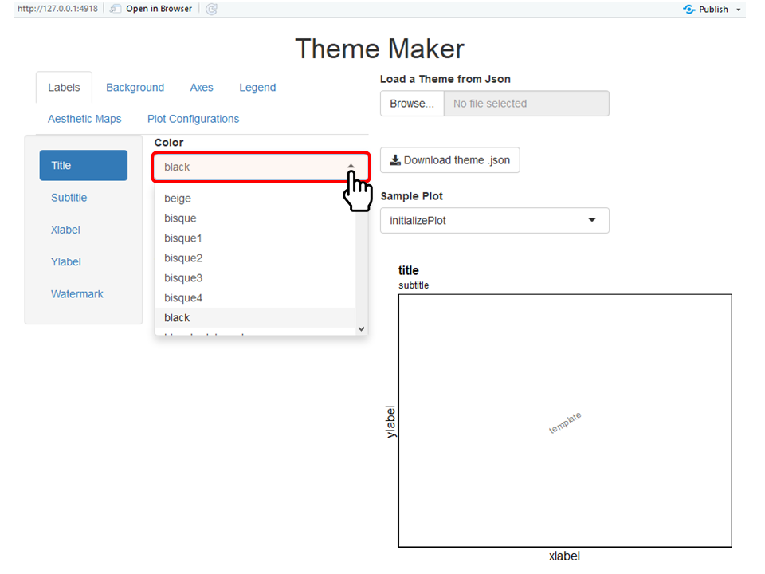
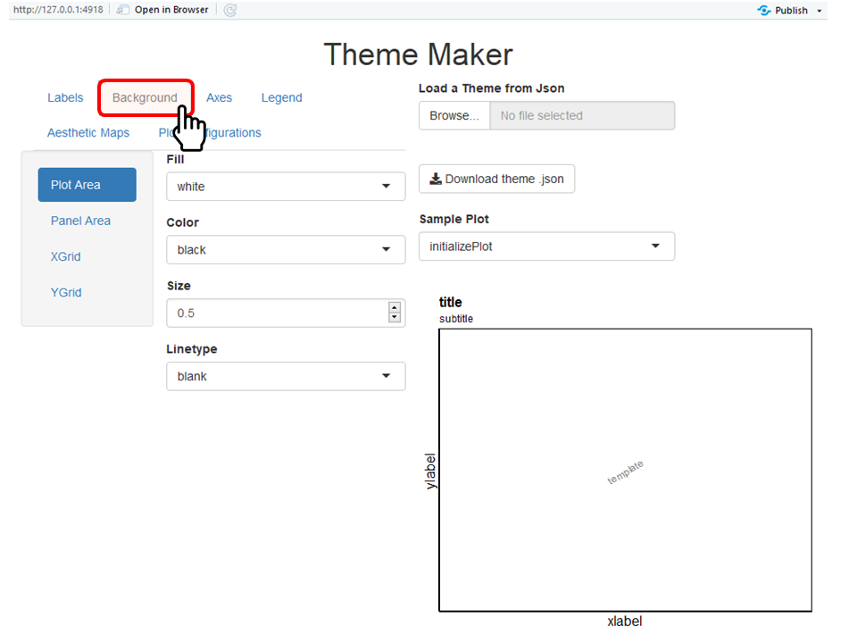
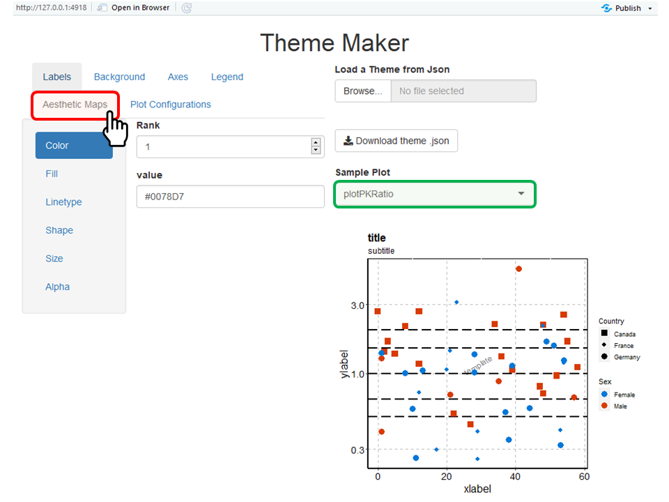
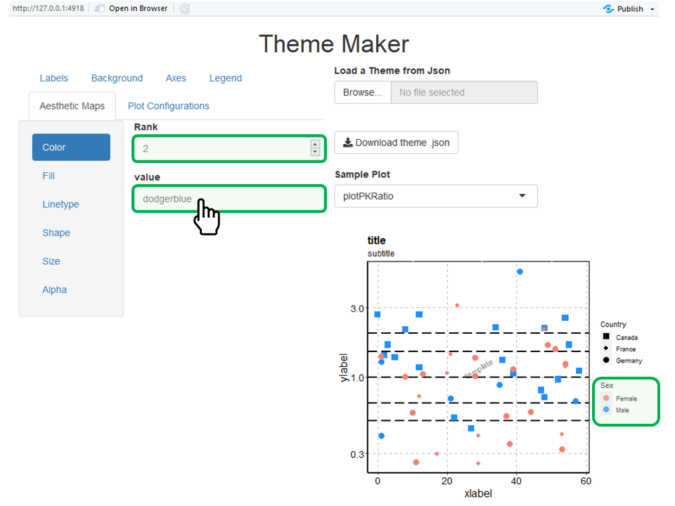

```{r, include = FALSE}
knitr::opts_chunk$set(
  collapse = TRUE,
  comment = "#>",
  dpi = 300,
  fig.align = "center",
  out.width = "100%",
  echo = FALSE
)
```

```{r setup}
require(tlf)
```

# 1. Introduction

The aim of this vignette is to document how to create, update, and save `Theme` objects using the `tlf` user interface (UI) called by **`runThemeMaker()`**.

`Theme` objects define the default values and methods of `PlotConfiguration` objects, which themselves describe the properties of a plot (such as colors, fonts, etc.).

# 2. How to start

Use the function `runThemeMaker()` to start the theme-maker User Interface. The function will load `shiny` required for the UI and set the current theme defined by the UI.

```{r start-theme-maker}
knitr::include_graphics("figures/theme-maker/start-theme-maker.png")
```

# 3. How to update theme properties

On the upper left side of the UI, a navigation bar indicates the main properties that can be updated in the theme: **Labels**, **Background**, **Axes**, **Legend**, **Aesthetic Maps** and **Plot Configurations**.

In the **Labels** navigation bar (already available when starting the UI), font properties of the most common labels are available. The font properties of ticks and legend are available in the properties **Axes** and **Legend**.
Note that *Color* properties use a predefined list of available colors as illustrated in the figure below, however, users can type and add their own colors (e.g. hex colors).

```{r theme-labels}

```

Properties of the watermark are available in the **Labels** navigation bar, and include the field *Content* which allows to define the content of the watermark (in this example the content is *template*).

The **Background** navigation bar includes the properties of the colors, sizes, and linetypes for each background elements (illustrated below). 

```{r theme-background}

```

The **Axes** navigation bar includes the properties of the axes lines (colors, sizes and linetypes) as well as the font properties of their ticks (illustrated below). 

```{r theme-axes}
knitr::include_graphics("figures/theme-maker/axes.png")
```

The **Legend** navigation bar includes the properties of the position, fonts, and background of the legend (illustrated below). 

```{r theme-legend}
knitr::include_graphics("figures/theme-maker/legend.png")
```

The **Aesthetic Maps** navigation bar defines the maps of aesthetic properties (color, fill, linetype, shape, size and alpha). 
Such maps can be used by `PlotConfiguration` objects to define how they will plot **points**, **lines**, **ribbons**, and **errorbars**.
Consequently, these properties are paired with the **Plot Configurations** navigation bar.

The **Plot Configurations** navigation bar defines the default aesthetic selection properties for each type of `PlotConfiguration` objects: it defines how to plot **points**, **lines**, **ribbons**, and **errorbars** for each type of atom or molecule plot available in the `tlf` package.

To illustrate these properties, the example below will update these properties for a PK ratio plots

First, select *plotPKRatio* in the list of sample plots to check the current features of the theme.
The list of sample plots available in the UI corresponds to all the atom and molecule plot functions defined in the `tlf` package.

```{r sample-plots}
knitr::include_graphics("figures/theme-maker/sample-plots.png")
```

Then, the **Aesthetic Maps** indicates for each aesthetic property pairs of rank-value for the aesthetic map. The current color map defines *30078D7* (blue color).

```{r aes-map}

```

The values can be changed as illustrated below where color ranked 1 was set as *salmon* and color ranked 2 was set as *dodgerblue*.

```{r aes-map-set}

```

On the **Plot Configurations** navigation bar, select the *plotPKRatio* (figure below). Three selection keys are available for this plot as it includes points, lines and optionally error bars.
The current selection key is **reset** which resets and uses in sequence the values of the color map.

```{r pk-ratio-color}
knitr::include_graphics("figures/theme-maker/pk-ratio-color.png")
```

The example below updates how the lines are drawn in the PK ratio plots. Currently, the selection key is defined as **Other** and the corresponding value has *longdash* which is translated as the PK ratio lines are all plotted as long dashes:

```{r pk-ratio-linetype}
knitr::include_graphics("figures/theme-maker/pk-ratio-linetype.png")
```

To update how lines are drawn in PK ratio plots, you can use a default linetype in the selection key **Other** or use the linetype map defined in the **Aesthetic Maps** navigation bar. Different keys are available when using the map: 

- **next** will select the next values of the map every time a line is added
- **same** will select the same value of the map every time a line is added
- **first** will select the first value of the map every time a line is added
- **reset** will select the next values of the map every time a line is added but resetting the count before the call of the plot function
- **other** allows you to specify a user defined lineytpe(s) not related to the map

```{r pk-ratio-selection-key}
knitr::include_graphics("figures/theme-maker/pk-ratio-selection-key.png")
```

By selecting *next*, the PK ratio plot uses the next value in the linetype map every time a line is added. In this example, this leads to draw the ratio of 1 as a solid line, the ratio of 1.5 as a longdash line and the ratio of 2 as a dotted line.

```{r pk-ratio-linetype-next}
knitr::include_graphics("figures/theme-maker/pk-ratio-linetype-next.png")
```


# 4. How to export and re-use a theme

The theme-maker UI allows an easy way to save your theme properties as a json file. This file can be reloaded when needed using the function `loadThemeFromJson(jsonFile)` and can be used as the current theme with the function `useTheme(theme)`.

To save your current theme using the UI, click on **Download theme .json** as illustrated in the figure below and indicate the location/name for saving the theme file.
Please remember to specify the **.json** file extension while saving the theme to a file. 

```{r save-theme}
knitr::include_graphics("figures/theme-maker/save-theme.png")
```

The UI also allows you to load a previously saved theme in `.json` file using the button **Load a Theme from Json** as illustrated in the figure below.

```{r use-saved-theme}
knitr::include_graphics("figures/theme-maker/use-saved-theme.png")
```
