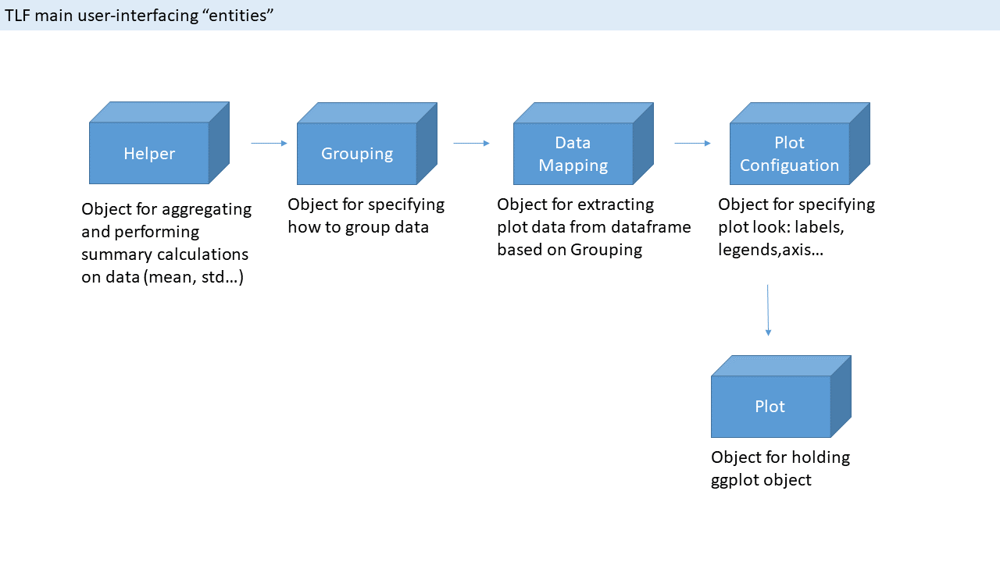

```{r, include = FALSE}
knitr::opts_chunk$set(
  collapse = TRUE,
  comment = "#>"
)
```

# Introduction
The following vignette aims at illustrating the workflow for performing Time Profile plots using the `tlf`-Library.

## Libraries

The main purpose of the `tlf`-library is to help in plotting standardized `ggplot` objects out of the `OSPSuiteR`. As such, `ggplot2` package needs to be installed.

```{r setup}
# The update of the tlf library with document needs to be called in the vignette
# Otherwise, the library is not up to date to be knitted
devtools::document()
library(tlf)
library(ggplot2)
```

The usual workflow suggested for performing any kind of plot with the `tlf`-library is specified and illustrated below. 
Please note that steps 2, 3 and 4 are not mandatory and will use default values if they are not defined. Besides, steps 3 and 4 can be independant.

1. Get the data to plot
2. Pre-process the data using `helper` and `grouping` classes and functions
3. Set the `dataMapping` which will define what you would like to plot
4. Set the `plotConfiguration` which will define how you would like to plot the data previously mapped
5. Plot the data using the dedicated function

## `tlf` workflow
```{r, out.width="100%", include=TRUE, fig.align="center", echo=FALSE}

```


# 1. Data

In the sequel, the data used for the time profile plot is a `data.frame` variable named `timeProfileDataFrame`.
A `metaData` variable can be used in association to the data. Its main purpose is to define additional information on the data such as the `dimension` and `units` of each of its variables. The lower limit of quantitiation of time profile data can be stored in such metaData.

## Dataset
```{r, results='asis'}
# Data frame printed in a nice markdown table:
pander::pandoc.table(timeProfileDataFrame[,c("IndividualID", "Time", "Gender", "Age", "Simulated")], justify='right', round=2)
```

## MetaData
```{r, results='asis'}
timeProfileMetaData <- list(Time = list(unit = "min", dimension = "time"), 
                            Simulated = list(unit = "ug/mL", dimension = "concentration"))
```


# 2. Pre-processing of the data

## Grouping
The `R6` class `Grouping` can help you process some of the data and define grouping variables which are often used by `ggplot` to split the data and create subsequent legend and captions.
Using this class, it is possible to create and add new columns to the data with captions as its values.

For instance, the following code map the `individualID` to specific `PatientName` whose variable can be added to `timeProfileDataFrame`.
```{r, results='asis'}
groupingIndividualsDf <- data.frame(IndividualID = c(1,2,3,4) , 
                                    PatientName = c("Paul", "John", "George", "Ringo"))

pander::pandoc.table(groupingIndividualsDf)
```

Then, this association is re-used in `dataMapping` to create a grouping variable (named `Group` below)
```{r, results='asis'}
individualGrouping <- Grouping$new(groupingName = "Group" , 
                                  groupingDataFrame = groupingIndividualsDf)

groups <- list(individualGrouping)
tpMapping <- TimeProfileDataMapping$new(x="Time", y="Simulated", groupings = groups)
pander::pandoc.table(tpMapping$getMapData(data = timeProfileDataFrame,
                     metaData = timeProfileMetaData))
```

## Helper

The `R6` class `TimeProfileHelper` can help you process some of the time profile data and obtain new aggregated data to plot. 
When initializing this helper, `valuesColumnNames` are the variables to be aggregated, `groupingColumnNames` are the variables that will group the data for the aggragtion , `aggregationFunctionsVector` is a vector of functions to be used during the aggregation and `aggregationFunctionNames` the name of the associated variables within the output `data.frame` of the helper.

The following example illustrates the outcome of the helper:
```{r, results='asis'}
hlp <- TimeProfileHelper$new(data = timeProfileDataFrame,
                             timeColumnName = "Time",
                             groupingColumnNames = c("Population"),
                             valuesColumnNames = "Simulated",
                             aggregationFunctionsVector = c(mean, min, max),
                             aggregationFunctionNames =  c("SimulatedMean", "SimulatedMin", "SimulatedMax"))


pander::pandoc.table(hlp$dfHelper, round=2)
```

# 3. dataMapping

The `R6` class `TimeProfileDataMapping` is dedicated to map `x`, `y` and `groupings` for time profile plots.
Its inner function `getMapData` creates an output `data.frame` mapping the `x`, `y` and `groupings` of a input `data`.

The basic example is to map only `x` and `y`:
```{r, results='asis'}
tpMapping <- TimeProfileDataMapping$new(x="Time", y="Simulated")
pander::pandoc.table(tpMapping$getMapData(data = timeProfileDataFrame,
                     metaData = timeProfileMetaData))
```

A more complex example is to add `groupings` to `x` and `y`:
```{r, results='asis'}
# Grouping using data.frame
groupingIndividualsDf <- data.frame(IndividualID = c(1,2,3,4) , PatientName = c("Paul", "John", "George", "Ringo"))

# Groupings using data.frame for individualID and variable names for Gender and Population
groups <- list(individualGrouping = Grouping$new(groupingName = "Beatles" , groupingDataFrame = groupingIndividualsDf), 
               populationGrouping = c("Gender", "Population"))

tpMapping <- TimeProfileDataMapping$new(x="Time", y="Simulated", groupings = groups)
pander::pandoc.table(tpMapping$getMapData(data = timeProfileDataFrame,
                     metaData = timeProfileMetaData))
```

Specific to time profiles, `TimeProfileDataMapping` allows the mapping of `yMin` and `yMax`.
These parameters are expected in case error bars are needed or in case a time range profile is needed.
If only `yMin` and `yMax` are input in the mapping `y` being undefined or `NULL`, the expected profile is a range.
If `y`, `yMin` and `yMax` are input in the mapping, the expected profile is an error bar.

```{r, results='asis'}
# Use the helper to aggregate min and max values

hlp <- TimeProfileHelper$new(data = timeProfileDataFrame,
                             timeColumnName = "Time",
                             groupingColumnNames = c("Population"),
                             valuesColumnNames = "Simulated",
                             aggregationFunctionsVector = c(mean, min, max),
                             aggregationFunctionNames =  c("SimulatedMean", "SimulatedMin", "SimulatedMax"))

tpMapping <- TimeProfileDataMapping$new(x="Time", y="SimulatedMean", yMin = "SimulatedMin", yMax = "SimulatedMax")

pander::pandoc.table(tpMapping$getMapData(data = hlp$dfHelper,
                     metaData = hlp$metaDataHelper))
```


# 4. plotConfiguration

The `R6` class `TimeProfilePlotConfiguration` is dedicated to set the configuration of time profile plots.
It is split into 4 subclasses:

- `LabelConfiguration` from which any `PlotConfiguration` inherits and that defines the size and fonts of the labels (title, xlabel, ...)
- `XAxisConfiguration` that defines the limits, scale and ticks of the x-axis
- `YAxisConfiguration` that defines the limits, scale and ticks of the y-axis
- `LegendConfiguration`

A `Theme` class can be used to standardize such a configuration. So far, 4 predefined themes are available: `defaultTheme`, `tlfTheme`, `bwTheme` and `bigTheme`. The function `useTheme` set a theme as the current theme of the environment.

For example:
```{r}
useTheme(tlfTheme)
```

The definition of the configuration can be performed as follows:
```{r}
config <- PlotConfiguration$new(title = "Title",
                      xlabel = "x-axis label", 
                      ylabel = "y-axis label", 
                      watermark = "background")

# Overall features of the configurtion
config

# Title and its configuration
config$title
config$title$font

# scale of x axis
config$xAxis$scale

```

Example for a time profile plot:
```{r}
tpConfig <- TimeProfilePlotConfiguration$new()

# Overall features of the configurtion
tpConfig
```

Since the plot configuration is not a necessary input, it can use default values using data, metaData and dataMapping as input.
Example for a time profile configuration using data, metaData and dataMapping:

```{r}
tpMapping <- TimeProfileDataMapping$new(x="Time", y="Simulated")

tpConfig <- TimeProfilePlotConfiguration$new(data = timeProfileDataFrame,
                                             metaData = timeProfileMetaData,
                                             dataMapping = tpMapping)

# Overall features of the configurtion
tpConfig
```

# 5. Examples

The function that creates ggplot objects for time profiles is `plotTimeProfile` whose input arguments are `data`, `metaData`, `dataMapping` and `plotConfiguration`.

## 5.1. Basic example of time profile plot

```{r, fig.height=5, fig.width=7.5}
# Map x and y of the plot
tpMapping <- TimeProfileDataMapping$new(x="Time", y="Simulated")

# Define the ggplot object
plotObject <- plotTimeProfile(data=timeProfileDataFrame, 
                              metaData = timeProfileMetaData,
                              dataMapping = tpMapping)
# Show plot
plotObject

```

## 5.2. Workflow example of time profile plot using `TimeProfilePlotConfiguration`

```{r, fig.height=5, fig.width=7.5}
# Set current theme
useTheme(tlfTheme)

# Map x and y of the plot
tpMapping <- TimeProfileDataMapping$new(x="Time", y="Simulated")

# Overwrite plot configuration 
tpConfig <- TimeProfilePlotConfiguration$new(title = "Example with different configuration",
                                             ylabel = "Simulated Results",
                                             data = timeProfileDataFrame,
                                             metaData = timeProfileMetaData,
                                             dataMapping = tpMapping)

# Define the ggplot object with updated configuration
plotObject <- plotTimeProfile(data=timeProfileDataFrame, 
                              metaData = timeProfileMetaData,
                              dataMapping = tpMapping, 
                              plotConfiguration = tpConfig)
# Show plot
plotObject

```

## 5.3. Workflow example of time profile plot using `TimeProfileDataMapping` with `Grouping`

```{r, fig.height=5, fig.width=7.5}
# Map x, y and groups of the plot
groups <- list(color = "IndividualID", 
               linetype = "Population")
tpMapping <- TimeProfileDataMapping$new(x = "Time", 
                                        y = "Simulated", 
                                        groupings = groups)

# Define the ggplot object
plotObject <- plotTimeProfile(data=timeProfileDataFrame,
                           metaData = timeProfileMetaData,
                           dataMapping = tpMapping)

# Show plot
plotObject

```

## 5.4. Workflow example of time profile plot using `TimeProfileDataMapping` with `Grouping` as data.frame

```{r, fig.height=5, fig.width=7.5}
# data.frame associating grouping to Individual ID with their captions
groupingIndividualsDf <- data.frame(IndividualID = c(1,2,3,4) , 
                                    PatientName = c("Paul", "John", "George", "Ringo"))
# Define the grouping variable
individualGrouping = Grouping$new(groupingName = "color" , 
                                  groupingDataFrame = groupingIndividualsDf, 
                                  groupingLegendTitle = "Name of Beatle")

groups <- list(color = individualGrouping)

# Map x, y and groups
tpMapping <- TimeProfileDataMapping$new(x = "Time",
                                        y = "Simulated",
                                        groupings = groups)

# Define the ggplot object
plotObject <- plotTimeProfile(data=timeProfileDataFrame,
                           metaData = timeProfileMetaData,
                           dataMapping = tpMapping)

# Show plot
plotObject

```

## 5.5. Workflow example of time profile plot using `TimeProfileDataMapping` with `Helper`

```{r, fig.height=5, fig.width=7.5}
# Define aggregated values through helper
hlp <- TimeProfileHelper$new(data = timeProfileDataFrame,
                             timeColumnName = "Time",
                             groupingColumnNames = c("Population"),
                             valuesColumnNames = "Simulated",
                             aggregationFunctionsVector = c(mean, min, max),
                             aggregationFunctionNames =  c("SimulatedMean", "SimulatedMin", "SimulatedMax"))

# Map x and y
tpMappingMean <- TimeProfileDataMapping$new(x = "Time", 
                                            y = "SimulatedMean")

tpConfig <-  TimeProfilePlotConfiguration$new(ylabel = "Simulated Results",
                                              xlabel = "Time")

# Define the ggplot object
meanPlot <- plotTimeProfile(data=hlp$dfHelper,
                            dataMapping = tpMappingMean,
                            plotConfiguration = tpConfig)
# Show plot
meanPlot


# Map x, yMin and yMax
tpMappingRange <- TimeProfileDataMapping$new(x = "Time", 
                                             yMin = "SimulatedMin", 
                                             yMax = "SimulatedMax")

# Define the ggplot object
rangePlot <- plotTimeProfile(data=hlp$dfHelper,
                            dataMapping = tpMappingRange,
                            plotConfiguration = tpConfig)

# Show plot
rangePlot

# Map x, y, yMin and yMax
tpMappingErrorBar <- TimeProfileDataMapping$new(x = "Time", 
                                                y = "SimulatedMean",
                                                yMin = "SimulatedMin", 
                                                yMax = "SimulatedMax")

# Define the ggplot object
errorBarPlot <- plotTimeProfile(data=hlp$dfHelper,
                                dataMapping = tpMappingErrorBar,
                                plotConfiguration = tpConfig)

# Show plot
errorBarPlot

```