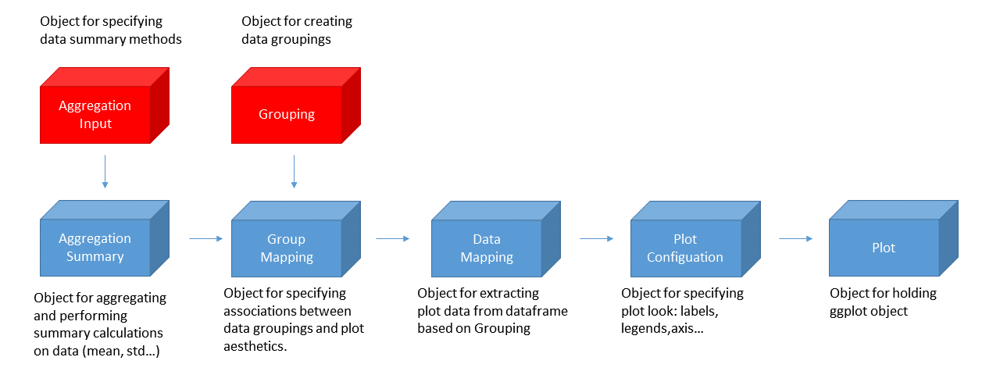

```{r setup, include = FALSE}
knitr::opts_chunk$set(
  collapse = TRUE,
  comment = "#>"
)
load("../data/pkRatioDataExample.RData")
load("../data/tlf-output.RData")
load("../data/timeProfileDataFrame.RData")
library(tlf)
```

# 1. Introduction
## 1.1. Objectives
The aim of this vignette is to document and illustrate the typical workflow needed for the production of plots using the `tlf`-library.

## 1.2. Libraries
The main purpose of the `tlf`-library is to standardized the production of `ggplot` objects from data output by the `OSPSuiteR`. 
As such, `tlf`-library requires that the `ggplot2` package be installed.

## 1.3. `tlf` typical workflow
The suggested workflow for performing any kind of plot with the `tlf`-library is illustrated in the figure below. 

```{r, out.width="100%", include=TRUE, fig.align="center", echo=FALSE}
# echo=FALSE prints only code chunk output

```

The standard workflow then proceeds as follows:

**Step 0 - Data gathering.** Gather the data into tidy `data.frame` format.

**Step 1 - Data pre-processing** Pre-process the data using `AggregationSummary` class.

**Step 2 - Data grouping** Use the `GroupMapping` class to specify groupings according to which the data will be captioned in figure legends.

**Step 3 - Data mapping.** Use the `DataMapping` class to select the independent and dependent variables of the processed data as well as the aesthetics that will be used to differentiate between the groupings of the data that were specified in step 2.

**Step 4 - Plot configuration** Set the `PlotConfiguration` object which will define settings of the plot such as axis labeling, font sizes and watermarks.

**Step 5 - Plot generation** Create a `ggplot` object from the above classes using the dedicated plotting function.

Steps 1, 2, 3 and 4 are not mandatory.  If not implemented, `tlf`-libray uses default settings in lieu of the objects that are otherwise created in these optional steps. In addition, the `PlotConfiguration` object and the `DataMapping` object can be created independently. 
Sections 2 to 4 will focus on `AggregationSummary`, `DataMapping` and `PlotConfiguration`.

## 1.4. Naming Conventions
In this package, it was chosen to use specific names for functions and classes referring to specific plots.
The naming convention for classes is `<Plot Name><Class>` and for function `<function><Plot Name>`. 
Below presents the table of specific classes and functions that are created using this convention:

```{r, echo = FALSE, results='asis'}
# This small script gives a fast way to introduce the nomenclature of the classes and functions
plotNames <- c("PKRatio", "TimeProfile", "Histogram", "BoxWhisker", "DDIRatio") #"GOF", 
classesNames <- c("DataMapping", "PlotConfiguration")
functionNames <- c("plot")

conventionTable <- data.frame(sapply(classesNames, function(x){paste0(plotNames, x)}), 
           sapply(functionNames, function(x){paste0(x, plotNames)}),
           row.names = plotNames)


knitr::kable(conventionTable)
```

# 2. Data pre-processing: `AggregationSummary` class

## 2.1. Data format

The workflow assumes that the data to be plotted has been gathered in the form of a [*tidy*](https://cran.r-project.org/web/packages/tidyr/vignettes/tidy-data.html) dataframe.  In a tidy format dataframe, each *measurement*, such as a simulation result or experimental observation, is described entirely in one row.  The columns of the dataframe are limited to no more than the *independent variable* columns of the measurement (in this example, *Time* and *IndividualID*) and the *dependent variable* columns (in this case *Organism|ArterialBlood|Aciclovir|Whole Blood*), which hold the value of the measurement.  Since no additional columns are allowed, two dependent variables that have differing sets of independent variables should each have their own tidy dataframes.

In the sequel, we will use a standard dataset exported from the `OSPSuiteR` package: `testData`. This data is a `data.frame` with 10 variables and 22500 observations.

```{r, echo=FALSE, results='asis'}
testData <- outputValues$data
knitr::kable(head(testData)) #For aesthetics of the table align='c', digits =2)
```

## 2.2. MetaData

A `metaData` variable associated with the data can be used to define additional information such as the `dimension` and `unit` of each column in the `data.frame`. The lower limit of quantitiation of a time profile  can also be stored in the `metaData`. The format of metaData is currently expected to be a list on each variable of lists showing unit and dimension.

```{r, results='asis', echo=FALSE}
testMetaData <- outputValues$metaData
metaDataTable <- data.frame("unit" = sapply(testMetaData, function(x){x$unit}),
                            "dimension" = sapply(testMetaData, function(x){x$dimension}))

knitr::kable(metaDataTable)
```

## 2.3. Aggregation

A common processing of the data is its aggregation. The aggregation consists in splitting the data into subsets, then computes summary statistics for each, and returns the result in a convenient form.
Visual predictive checks are typical plots where such method is useful.

The `AggregationSummary` class is a helper class that simplifies the use of aggregation methods on the data.
The `R6` class `AggregationSummary` automates the computation of multiple summary statistics of the raw data that is output by **Step 0**.  The output of this optional data pre-processing step is a dataframe with a column for each summary statistic.  This dataframe can be input into the subsequent steps of the workflow.  The user also has the option of generating `metaData` for each of the summary statistics evaluated.

To illustrate the functions of this class for the example of the dataframe `testData`, let's suppose that for each timepoint in the *Time* column, the *minimum* and the *mean* value of the simulated  *Organism|ArterialBlood|Aciclovir|Whole Blood* column is to be computed for each gender in the *Gender* column.  The `AggregationSummary` class works in 3 steps:

1. Three sets of columns are selected from the input dataframe `data`: an *independent variable* set called `xColumnNames` (in this case, the *Time* column in `testData`),  a *grouping variables* set called `groupingColumnNames` (the *Gender* column in `testData`) and a *dependent variables* set called `yColumnNames` (the *Organism|ArterialBlood|Aciclovir|Whole Blood* column in `testData`).

2. For each value of the independent variable `xColumnNames`, the rows of the dataframe are aggregated into groups defined by unique combinations of the elements in the grouping variable columns `groupingColumnNames`.

3. Summary statistics (in this case, the `minimum` and the `mean`) for the `yColumnNames` variables in each group are evaluated.  The functions for computing the the summary statistics are specified when initializing an `AggregationSummary`, via `aggregationFunctionsVector`.  User-specified descriptive names of these functions are supplied via the vector of strings named `aggregationFunctionNames`.  The units and dimensions of the outputs of these functions are supplied via the vectors of strings named `aggregationUnitsVector` and `aggregationDimensionsVector`, respectively. 

For this example, the `AggregationSummary` object `aggSummary` is instatiated as follows:

```{r, results='asis'}
aggSummary <- AggregationSummary$new(data = testData , 
                                     metaData = testMetaData,
                                     xColumnNames = "Time",
                                     groupingColumnNames = "Gender",
                                     yColumnNames = "Organism|ArterialBlood|Aciclovir|Whole Blood",
                                     aggregationFunctionsVector = c(min,mean),
                                     aggregationFunctionNames =c("Simulated Min",
                                                                 "Simulated Mean"),
                                     aggregationUnitsVector = c("µmol/l","µmol/l"),
                                     aggregationDimensionsVector = c("Concentration",
                                                                     "Concentration"))
```

The dataframe that holds the summary statistics of the aggregated rows is stored in the `dfHelper` property of the resulting `aggSummary` object.  Since two functions (`min` and `mean`) were specified in `aggregationFunctionsVector`, the dataframe `aggSummary$dfHelper` has, in addition to the `xColumnNames`and `groupingColumnNames` columns, two additional columns named `Simulated Min` and `Simulated Mean`, which were the names specified in `aggregationFunctionNames`.

```{r, echo=FALSE, results='asis'}
knitr::kable(head(aggSummary$dfHelper, digits=2))
```

The `metaData` corresponding to the columns of the resulting dataframes are lists that are stored together in a list with the `metaData` of the `xColumnNames`and `groupingColumnNames` columns.  The `metaData` for the new `aggSummary$dfHelper` dataframe is stored as the `metaDataHelper` property of the `aggSummary` object. For this example, the two `metaData` lists corresponding to the `Simulated Min` and `Simulated Mean` columns are also are labeled `Simulated Min` and `Simulated Mean`. The contents of the list `aggSummary$metaDataHelper` are:

```{r, results='asis'}
# Currently issue with metaData of Gender
aggSummary$metaDataHelper[[2]] <- NULL
aggMetaData <- data.frame("unit" = sapply(aggSummary$metaDataHelper, function(x){x$unit}),
                          "dimension" = sapply(aggSummary$metaDataHelper, function(x){x$dimension}))

knitr::kable(aggMetaData)
``` 

# 3. Mapping and grouping of data: `DataMapping` class.

The role of the `DataMapping` class is to provide a user-friendly interface to indicate what data should plotted.
In most cases, this class needs to be initiliazed to map what variable is `x`,  `y` and sometimes what variable(s) will group the data.
Thus, the most common input are `x` and `y`, however, for more advanced plots input such as `groupMapping` may be used often.
For advanced plots, subclasses are derived from `DataMapping`, they use unique input and default related to the advanced plot to make it easier to use them.

## 3.1. GroupMapping
### 3.1.1. Grouping class

An `R6` class called `Grouping` can be used to group the data into subsets that, in the final plots, are to be distinguished both aesthetically and in legend captions.  In addition, these subsets can be listed under descriptive legend titles.  

  As an example, a `Grouping` object called `grouping1` can be used to specify that the data in a *tidy* dataframe such as `timeProfileDataFrame` should be grouped by both "Compound" and "Dose":
```{r, results='asis'}
# Grouping by variable names:
grouping1 <- Grouping$new(c("Compound","Dose"))
```
With this minimal input, a legend associated with this grouping will have the default title "Compound-Dose".  On the other hand, a custom title for this grouping and its legend can be supplied by the user with the optional `label` input:
```{r, results='asis'}
# Grouping by variable names and overwriting the default label:
grouping2 <- Grouping$new(group = c("Compound","Dose"), label = "Compound & Dose")
```

In the above two examples, default captions are constructed by hyphenating the compound type and the dose amount for each row.  Alternatively, the captions can be customized by the user by supplying a dataframe with the custom captions to the `group` input of the `Grouping` object constructor.  The format of this dataframe is such that the rightmost column contains the desired captions, the name of this rightmost column is the default legend title for this grouping, and the remaining columns define the combinations of row entries that are to receive each caption in the rightmost column.  To illustrate this method, the following dataframe `mappingDataFrame` is used to assign captions based on entries in the "Dose" and "Compound" columns.  For example the caption "6mg of Aspirin" is assigned to any row in which the "Dose" entry is 6 and the "Compound" entry is "Aspirin". 
```{r, results='asis'}
# Grouping using a data.frame:
mappingDataFrame <- data.frame(Compound = c("Aspirin","Aspirin","Sugar","Sugar"),
                               Dose = c(6,3,6,3),  
                               "Compound & Dose"  = c("6mg of Aspirin",
                                                      "3mg of Aspirin",
                                                      "6mg of Sugar",
                                                      "3mg of Sugar"),
                               check.names = FALSE)
knitr::kable(mappingDataFrame)
grouping3 <- Grouping$new(group = mappingDataFrame)
```

The default title of the legend that results from this grouping is the name of the rightmost column, which is "Compound & Dose".  Note that the `check.names` option should be set to `FALSE` when creating the dataframe `mappingDataFrame` since the legend title contains spaces in this instance.  This legend title can be overridden to be another string by using the `label` input of the object constructor, as in the case of `grouping2` above.

The three `Grouping` objects, `grouping1`, `grouping2` and `grouping3` respectively yield the last three columns of the following dataframe:
```{r, results='asis'}
# Apply the mapping to get the grouping captions:
groupingsDataFrame <- data.frame(timeProfileDataFrame$IndividualID,
                                 timeProfileDataFrame$Dose,
                                 timeProfileDataFrame$Compound,
                                 grouping1$getCaptions(timeProfileDataFrame),
                                 grouping2$getCaptions(timeProfileDataFrame),
                                 grouping3$getCaptions(timeProfileDataFrame))

names(groupingsDataFrame) <- c("IndividualID", "Dose", "Compound",
                               grouping1$label, grouping2$label, grouping3$label)

# Show results for all groupings:
knitr::kable(groupingsDataFrame)
```

A dataframe can also be used to create a `Grouping` object that subsets the data based on whether a numeric grouping variable satisfies an specific inequality.  For example, individuals in `timeProfileDataFrame` can be grouped according to whether or not their age exceeds 6 years by first defining the following dataframe:
```{r, results='asis'}
# Grouping using a data.frame:
binningDataFrame <- data.frame(Age = I( list(c(0,6),c(7,100)) ), 
                               "Age Range" = c("Age 6 or lower",
                                               "Above age 6"),
                               check.names = FALSE)
```
Then creating a new grouping:
```{r, results='asis'}
grouping4 <- Grouping$new(group = binningDataFrame)
```
 
This new `Grouping` object `grouping4` yields the following captions

```{r, results='asis'}
# Apply the mapping to get the grouping captions:
binnedGroupingsDataFrame <- data.frame(timeProfileDataFrame$IndividualID,
                                       timeProfileDataFrame$Age,
                                       grouping4$getCaptions(timeProfileDataFrame)) 

names(binnedGroupingsDataFrame) <- c("IndividualID", "Age", grouping4$label)

# Show results for all groupings:
knitr::kable(binnedGroupingsDataFrame)
```

### 3.1.2. GroupMapping class 

An additional `R6` class called `GroupMapping` maps `Grouping` objects to aesthetic parameters such as `color` or `linetype`.  To distinguish between "Compound" and "Dose" groups by color and to use the captions and legend title specified in `grouping2`, the following groupings object `groups1` is constructed:

```{r, results='asis'}
# Map groups to aesthtic properties
groups1 <- GroupMapping$new(color =  grouping2 )
```

A `GroupMapping` object `groups2` can also be constructed more quickly by directly associating an aesthetic, such as `color`, to a vector of dataframe column names:
```{r, results='asis'}
# Map groups to aesthtic properties
groups2 <- GroupMapping$new(color = c("Compound", "Dose"))
```

or to a `Grouping` object directly:
```{r, results='asis'}
# Map groups to aesthtic properties
groups3 <- GroupMapping$new(color = Grouping$new(group = c("Compound", "Dose"),
                                                  label = c("Compound & Dose")))
```

## 3.2. DataMapping

The `R6` class `TimeProfileDataMapping` extracts the time profile plot data from an input dataframe and groups it according to the aesthetics specified in an input `GroupMapping` object.  This mapping is carried out by an internal function of this class named `checkMapData` which check if the variables indicated the `GroupMapping` are included in the data. Then, this method returns a simplified data.frame with the variables defined by the dataMapping. 
 
When no `GroupMapping` object is supplied upon construction of a `TimeProfileDataMapping` object, the function `checkMapData` returns a dataframe with `x` and `y`.
A dummy variable named `aesDefault` is added to the data.frame, its sole purpose is to allow modifications of aesthetic properties after the creation of the ggplot object (not possible otherwise).
```{r, results='asis'}
tpMapping <- TimeProfileDataMapping$new(x="Time", y="Simulated")
knitr::kable(tpMapping$checkMapData(data = timeProfileDataFrame,
                                            metaData = timeProfileMetaData))
```

When a `GroupMapping` object is supplied upon construction of the `TimeProfileDataMapping` object, each `x`,`y` pair is associated with a group that can be used to distinguish the pair aesthetically in the final plot:
```{r, results='asis'}
# Re-use the variable groups previously defined
tpMapping <- TimeProfileDataMapping$new(x="Time", y="Simulated", 
                                        groupMapping = groups1)

knitr::kable(tpMapping$checkMapData(data = timeProfileDataFrame))
```

A feature of `TimeProfileDataMapping` class is that, in addition to specifying a `y` column, the user may also supply `ymin` and `ymax` columns that can represent the boundaries of error bars. If only `ymin` and `ymax` are input when constructing the `TimeProfileDataMapping` object, with `y` left undefined or `NULL`, the default profile that will ultimately be plotted is a range plot.   If `y`, `ymin` and `ymax` are all input, the default plot will be a time profile plot with an error bar.


# 4. Configure plot features: `PlotConfiguration` class.

The role of the `PlotConfiguration` class is to provide a user-friendly interface to configure how the plot should look like.
In most cases, this class may be initialized with default settings within the plot function.
For cases where the plot needs specific settings or default, the class or its default values can be overwritten.
For advanced plots, subclasses are derived from `PlotConfiguration`, they use unique inputs and default related to the advanced plot to make it easier to use them.

In more details, the `PlotConfiguration` class is a `R6Class` regrouping  other `R6Class` objecrs defining specific settings to be implemented:
* `LabelConfiguration` defines the labels of the plot (title, subtitles, x axis, y axis)
* `LegendConfiguration` defines the legend properties of the plot
* `BackgroundConfiguration` defines the bakground properties of the plot (color, grid, watermark)
* `xAxisConfiguration` defines the properties of the X axis (scale, limits, printed values)
* `yAxisConfiguration` defines the properties of the Y axis (scale, limits, printed values)

## 4.1. Labels Configuration

The labels configuration is a class that define a `Label` class for each plot label. 
The `Label` class is defined by its `text` and `font`. The `font` is a class regrouping the `color`, `size`, `fontFace` and `fontFamily` of the font.
For instance, 
```{r, result='as.is'}
title <- Label$new(text = "This is a title text",
                   font = Font$new(color = "red",
                                   size = 12))

knitr::kable(data.frame("text" = title$text, 
           "color" = title$font$color,
           "size" = title$font$size,
           "face" = title$font$fontFace,
           "family" = title$font$fontFamily
           ))
```

Within the `PlotConfiguration` each label uses a default font and text defined from the current `Theme`, however this default can be overwritten.
```{r, result='as.is'}
config <- PlotConfiguration$new()
tilteConfig <- config$title

knitr::kable(data.frame("text" = tilteConfig$text, 
           "color" = tilteConfig$font$color,
           "size" = tilteConfig$font$color,
           "face" = tilteConfig$font$fontFace,
           "family" = tilteConfig$font$fontFamily
           ))

```

Advanced plots can use different defaults, which can be overwritten as well:
```{r, result='as.is'}
config <- PKRatioPlotConfiguration$new()
tilteConfig <- config$title

knitr::kable(data.frame("text" = tilteConfig$text, 
           "color" = tilteConfig$font$color,
           "size" = tilteConfig$font$color,
           "face" = tilteConfig$font$fontFace,
           "family" = tilteConfig$font$fontFamily
           ))

```

## 4.2. Background Configuration

Background configuration defines the configuration of the following Background elements: `innerBackground`, `outerBackground`, `grid` and `watermark`.
If `watermark` is also a `Label` class, the 3 other elements are `BackgroundElementConfiguration` which can associate a color, linetype and size to the frame or grid of the background as well as a color fill for inner and outer background.
As for all the `PlotConfiguration` input, default is defined from the current `Theme`, however this default can be overwritten.
For instance:
```{r, result='as.is'}
background <- BackgroundConfiguration$new()

knitr::kable(data.frame("grid color" = background$grid$color, 
           "grid linetype" = background$grid$linetype, 
           "grid size" = background$grid$size))

```


## 4.3. Axes Configuration

`XAxisConfiguration` and `YAxisConfiguration` define the axes settings of the plot.
Within each axis configuration, `limits`, `scale`, `ticks` and their `ticklabels` can be defined.
A list of available scales can be used directly from the enum `Scaling`: 
```{r, results='as.is', echo=FALSE}
knitr::kable(data.frame("Scaling" = as.character(sapply(Scaling, identity))))

```

## 4.4. Legend Configuration

The legend configuration set the `position`, `title(s)`, `captions` `values` of the legend(s).
A list of available positions can be used directly from the enum `LegendPositions`: 
```{r, results='as.is', echo=FALSE}
knitr::kable(data.frame("LegendPositions" = as.character(sapply(LegendPositions, identity))))
```

The other features are `GrouMapping` classes since they will match the groups defined by the data mapping step.
For each group, default `titles` and `captions` will use the data specified by the groupMapping defined with `DataMapping`, however they can be overwritten.
`Values` correspond to the actual `colors`, `linetypes`, `shapes`, `fills`, `sizes` of the plot. The default are defined within the `Themes`, however they can also be overwritten.
For instance, the current default `values` are :
```{r, results='as.is', echo=FALSE}
legend <- LegendConfiguration$new()
# Currently color and fill have only 8 values, lintype 6 and shape and size 10.
# The following table will fill with "" the empty spaces
knitr::kable(data.frame("color" = c(legend$values$color, rep("",2)),
                        "fill" = c(legend$values$fill, rep("",2)),
                        "linetype" = c(legend$values$linetype, rep("",4)),
                        "shape" = legend$values$shape,
                        "size" = legend$values$size))
```

## 4.5. Themes

The class `Theme` allows a user-friendly way to set many default plot settings. 
Three predefined themes `defaultTheme`, `tlfTheme` and `bwTheme` are already available and can be used as templates, or it is possible to creates one's own theme either by initiliazing the class with overwritten or default input.
The themes defines not only the default for simple but account for advanced plots as well.

In order to define a theme as the current default, the function `useTheme(theme)` needs to be called.
For instance,
```{r}
useTheme(tlfTheme)
```

# 5. Minimal example

The following minimal example show how to perform a basic time profile plot:
Data output from the `OSPSuiteR` is available in `data/tlf-output.RData` and includes `outputValues` which is a list containing data in as a data.frame and metaData as a list.

A basic workflow defining the steps of mapping and setting the plot configuration can be:

```{r, fig.height=5, fig.width=7.5}
# Input data and their metaData
data <- outputValues$data
metaData <- outputValues$metaData

variableNames <- names(data)

# Mapping x as Time, 8th variable of data as y and group the color by Gender
variableNames[8]

map <- TimeProfileDataMapping$new(x = "Time", 
                                  y = variableNames[8],
                                  color = "Gender")

# Define the default Theme
useTheme(tlfTheme)

# Define Y axis as a log scale
yAxis <- YAxisConfiguration$new(scale = Scaling$log10)

# By using metaData and dataMapping, the configuration get the label as dimension [unit] directly
config <- TimeProfilePlotConfiguration$new(title = "Minimal Example",
                                           yAxis = yAxis,
                                           data = data,
                                           metaData = metaData,
                                           dataMapping = map)

# Get the ggplot object
timeProfile <- plotTimeProfile(data = data,
                               metaData = metaData,
                               dataMapping = map,
                               plotConfiguration = config)
timeProfile
```

